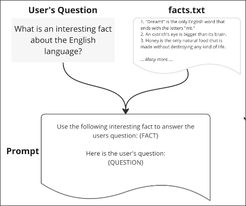

# Search Criteria

In [[2025-01-28_Loading-Files-with-Document-Loaders|Loading Files with Document Loaders]], we learned how to load different type of files with LangChain's loader classes. But the final goal of it is to build the prompt with user's input.

For this purpose, there are some options we can use:

## 1. Put the entire contents of the file into the prompt

**Downside**:
- longer prompts = costs more to run
- longer prompts = takes longer to run
- longer prompts = LLM has a harder time finding relevant facts

## 2. Put only the top 1-3 relevant facts into the prompt

**Upside**:
- shorter prompt! Less expensive, faster, more focused.

**Downside**:
- need to somehow figure out what the top 1-3 relevant facts are

In order to address the downside of option 2, we can break down each fact and compare the number of matching words with user input one by one to determine which fact is the most relevant.

This comparison method is very rough, it does not truly understand the meaning of the sentences.

If the word "English" is removed from the user input, the most relevant fact corresponds to the fourth one, but the meanings of the two are completely unrelated.

We'll learn how to improve this in the next topic.

