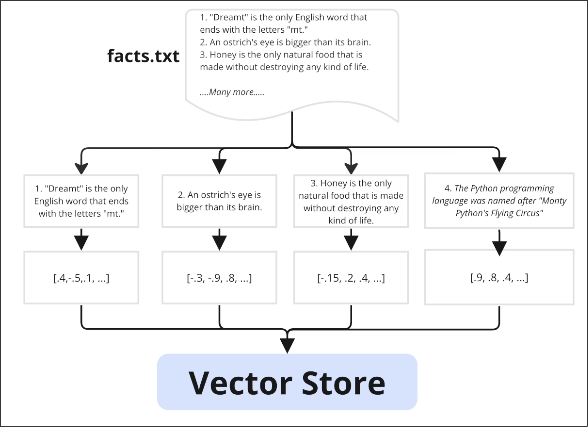
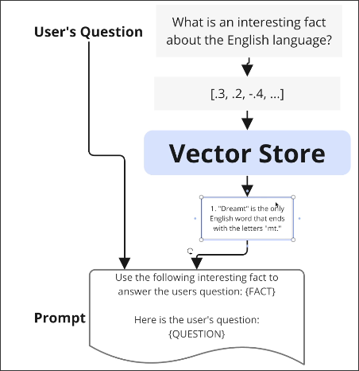

# The Entire Embedding Flow

After [[2025-01-28_Introducing-Embeddings|Introducing Embeddings]], we can now go through the entire embedding flow.

Before the user asks a question, we need to do some preprocessing as follows:

1. **Splitting**: We split the fact from the `Document` object.
2. **Embedding**: Calculate embeddings for each fact.
3. **Store to Vector Store**: Store the embeddings in a database specialized for embeddings.

After preprocessing is completed, we just need to wait for the user to ask questions. When the user asks a question, we need to do the following things:

1. **Embedding**: Calculate the embedding for the user's question.
2. **Semantic Search**: Search for the most similar embeddings in the Vector Store.
3. **Build Prompt**: Put the most similar facts into a prompt with user's question.

