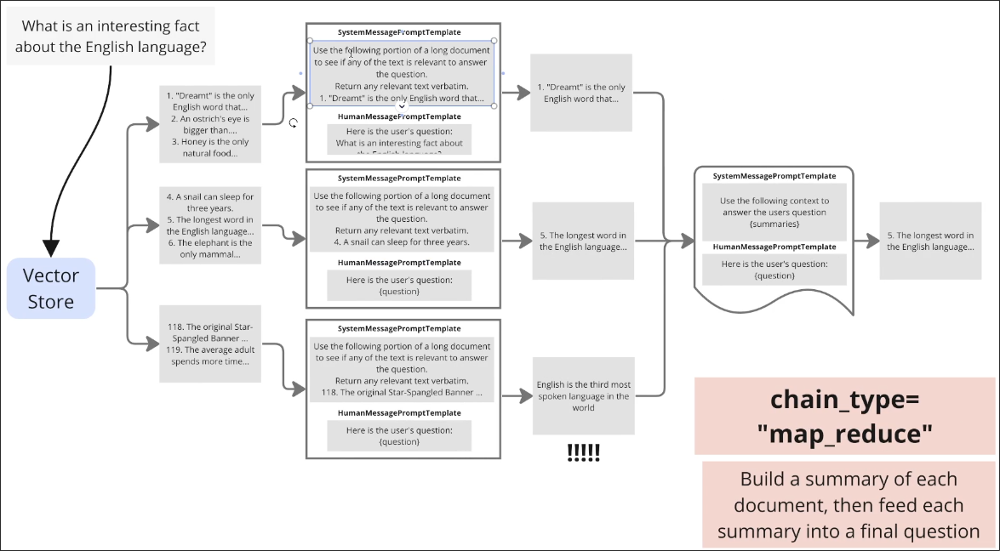

# Understanding map_reduce chain type

In [[2025-01-29_What-is-a-Retriever?|What is a Retriever?]], we simple joined the page_content of documents and _stuff_ the joined content into the placeholder of the prompt.

Besides the above way, we have another way to put the documents' contents into the prompt. We'll introduce the `map_reduce` way in this topic.



As shown in the above figure, the `map_reduce` method involves running each document through the prompt template and llm process once, collecting all responses, concatenating all responses, and then inputting the concatenated response into the next prompt template and llm process, ultimately obtaining the final response.


In new Langchain, it's recommended to use the LangGraph to build the map-reduce logic. Here is an example of how to build a map-reduce chain using LangGraph:

```python
from typing import List, TypedDict
from langchain_openai import OpenAIEmbeddings, ChatOpenAI
from langchain_chroma import Chroma
from langchain_core.prompts import ChatPromptTemplate
from langchain_core.output_parsers import StrOutputParser
from langgraph.graph import END, START, StateGraph
from langchain.schema.runnable import RunnableConfig
import argparse

class GraphState(TypedDict):
    query: str
    documents: List
    summaries: List[str]
    final_answer: str

def create_retriever():
    embeddings = OpenAIEmbeddings(model="text-embedding-3-large")
    db = Chroma(
        embedding_function=embeddings,
        persist_directory="emb"
    )
    return db.as_retriever()

def retrieve(state: GraphState):
    retriever = create_retriever()
    documents = retriever.invoke(state['query'])
    return {"documents": documents}

def map_documents(state: GraphState):
    llm = ChatOpenAI(model="gpt-4o-mini")
    prompt = ChatPromptTemplate.from_messages([
    ("system", """You are an assistant, use the context retrieved below to answer the questions. If you don't know the answer, honestly say you don't know. Try to answer concisely, using up to three sentences.

    Context: {context}"""),
    ("human", "{question}")
])

    
    summaries = []
    for doc in state['documents']:
        chain = (
            prompt
            | llm
            | StrOutputParser()
        )
        summary = chain.invoke({
            "context": doc.page_content,
            "question": state['query']
        })
        summaries.append(summary)
    
    return {"summaries": summaries}

def reduce_summaries(state: GraphState):
    llm = ChatOpenAI(model="gpt-4o-mini")
    prompt = ChatPromptTemplate.from_messages([
    ("system", """You are an assistant, use the context retrieved below to answer the questions. If you don't know the answer, honestly say you don't know. Try to answer concisely, using up to three sentences.

    Context: {context}"""),
    ("human", "{question}")
])
    
    chain = (
        prompt
        | llm
        | StrOutputParser()
    )
    final_answer = chain.invoke({
        "context": "\n\n".join(state['summaries']),
        "question": state['query']
    })
    
    return {"final_answer": final_answer}

def create_map_reduce_graph():
    workflow = StateGraph(GraphState)
    
    workflow.add_node("retrieve", retrieve) # Retrieve relevant documents from the vector storage
    workflow.add_node("map", map_documents) # use each document to go through the prompt template and llm process
    workflow.add_node("reduce", reduce_summaries) # concatenate all responses and input into the next prompt template and llm process
    
    workflow.add_edge(START, "retrieve")
    workflow.add_edge("retrieve", "map")
    workflow.add_edge("map", "reduce")
    workflow.add_edge("reduce", END)
    
    return workflow.compile()

def main():
    parser = argparse.ArgumentParser()
    parser.add_argument("--query", required=True, help="Query to search and summarize")
    args = parser.parse_args()

    graph = create_map_reduce_graph()
    
    try:
        config: RunnableConfig = {"configurable": {"thread_id": "unique_thread"}}
        result = graph.invoke({"query": args.query}, config)
        
        print("Final Answer:")
        print(result['final_answer'])
    
    except Exception as e:
        print(f"An error occurred during execution: {str(e)}")

if __name__ == "__main__":
    main()

```

## Downside of map_reduce

The content of the last few chunks obtained from the vector storage may have no relation to the query, so it is possible that during the map_documents stage, LLM will make up some content that does not exist in the documents. This may result in the final result not being composed of the documents in the vector storage.

Therefore, we must clearly inform LLM in the prompt of the map_documents stage that it must answer the questions based on the content of the documents, rather than making up answers on its own.
