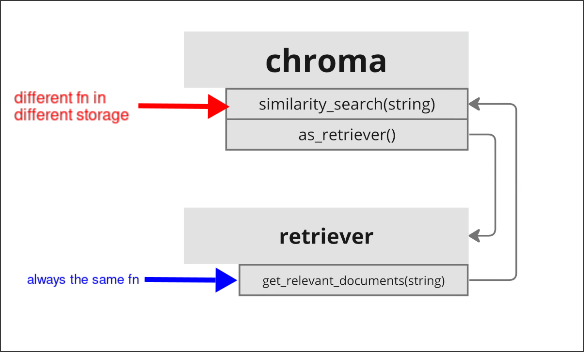

# What is a Retriever?

Because there are many types of vector storage, we need a unified interface to handle these different vector storage. Retriever is such an interface, defining a unified API to handle different vector storage.

In new LangChain, `get_relevant_documents` is replaced by `invoke` method, which implies that the retriever is a Runnable object.

