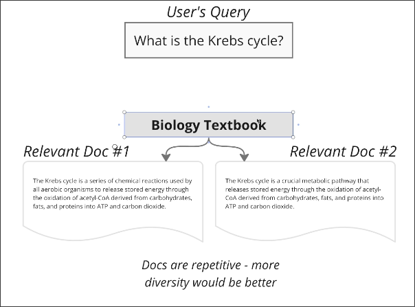
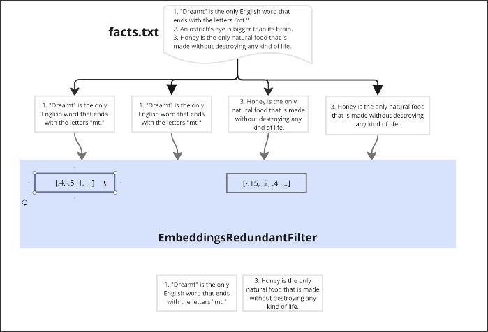
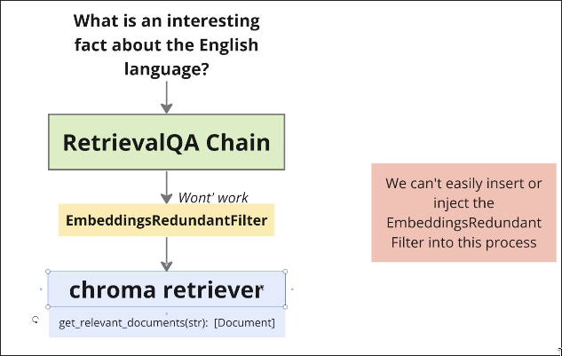
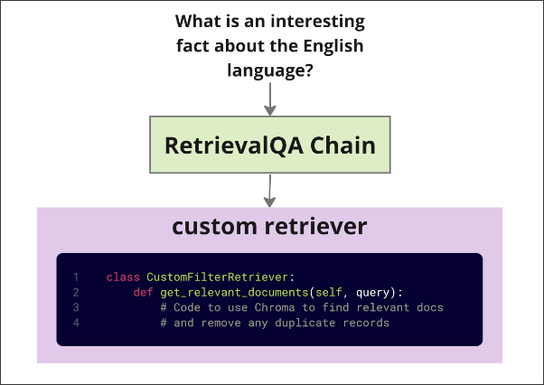

# Removing Duplicate Documents

## What is a Duplicate Document?

Some data sources themselves may contain duplicate documents in their content.

Although the two Docs above are slightly different, the content is basically the same, which is a common occurrence in data.

However, if these duplicate documents are used as context for feeding LLM, it will not be helpful for the results, and may even limit the diversity of the results.

## EmbeddingRedundantFilter

LangChain provides a class `EmbeddingRedundantFilter` to filter out duplicate documents. It will calculate the embeddings of multiple documents itself, and filter out documents with excessively high similarity.

However, it is not compatible with vector storage and the RetrievalQA chain in terms of usage. It is more like a class that can only operate independently, unable to use pre-calculated embeddings from vector storage to filter duplicate documents and cannot be inserted into the RetrievalQA chain.

## Write custom retriever with filter functionality

To solve this problem, we can write a custom retriever with filter functionality. The custom retriever should be able to filter out duplicate documents by using pre-calculated embeddings from vector storage.

We'll do thie in the next topic.

