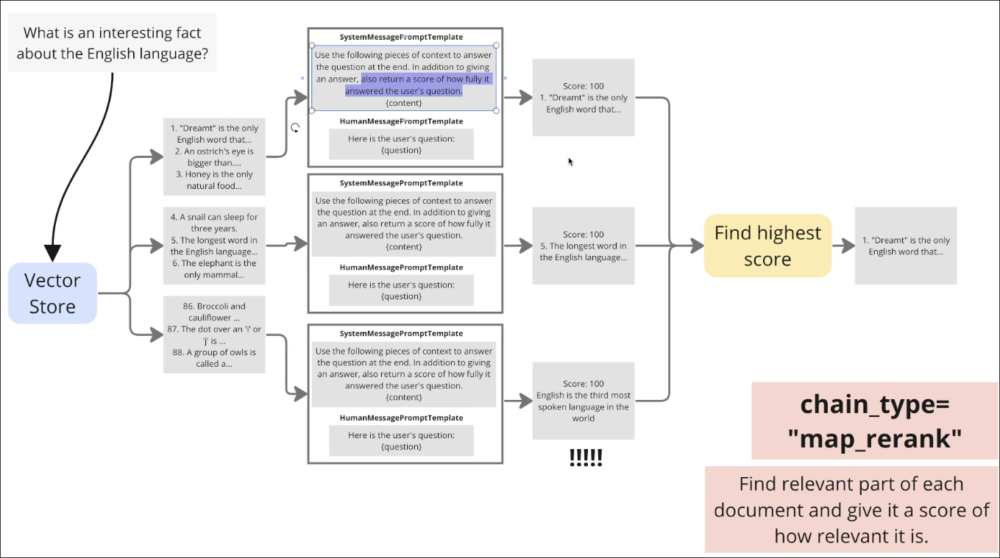

# Understanding MapRerank

Similar to [[2025-01-29_Understanding-map_reduce-chain-type|map_reduce]], but adds scores to each map document response, and in the end, use documents with the highest scores to get the final result.



## Coding Example

```python
from typing import List, TypedDict
from langchain_core.documents import Document
from langchain_openai import OpenAIEmbeddings, ChatOpenAI
from langchain_chroma import Chroma
from langchain_core.prompts import ChatPromptTemplate
from langchain_core.output_parsers import StrOutputParser
from langgraph.graph import END, START, StateGraph
from langchain.schema.runnable import RunnableConfig
import argparse
import re
from operator import itemgetter

class GraphState(TypedDict):
    query: str
    retrieved_documents: List[Document]

    # map score to each document
    documents: List[str]
    scores: List[int]

    final_answer: str

def create_retriever():
    embeddings = OpenAIEmbeddings(model="text-embedding-3-large")
    db = Chroma(
        embedding_function=embeddings,
        persist_directory="emb"
    )
    return db.as_retriever()

def retrieve(state: GraphState):
    retriever = create_retriever()
    documents = retriever.invoke(state['query'])
    return { 'retrieved_documents': documents }

def map_documents(state: GraphState):
    llm = ChatOpenAI(model="gpt-4o-mini")

    # asking the llm to answer the question with confidence score
    prompt = ChatPromptTemplate.from_messages([
        ("system", """
        You are an expert document analyzer. 
        Your task is to:
        1. Carefully read the given context
        2. Answer the question based strictly on the context
        3. Provide a confidence score from 1-10

        Output format:
        Answer: <your detailed answer>
        Score: <1-100 score>

        Scoring Guidelines:
        - 100: Extremely confident, answer is directly and explicitly stated in the context
        - 71-99: Very confident, answer is clearly implied
        - 41-70: Moderately confident, some inference required
        - 11-39: Low confidence, answer is speculative
        - 0-10: Cannot answer from the given context
        """),
        ("human", """
        Question: {query}
        Context: {context}

        Analyze the context and provide your answer with a confidence score.
        """)
    ])

    chain = (
        prompt
        | llm
        | StrOutputParser()
    )

    answers = []
    scores = []

    for doc in state['retrieved_documents']:
        response = chain.invoke({
            "context": doc.page_content,
            "query": state['query']
        })
        answer, score = parse_response(response) # parse the response to get answer and score
        answers.append(answer)
        scores.append(score)  # add the score to the state

    return { 'documents': answers, 'scores': scores }

    
# function to parse the response and extract answer and score above
def parse_response(response): 
    answer_match = re.search(r'Answer:(.*?)Score:', response, re.DOTALL)
    score_match = re.search(r'Score:\s*(\d+)', response)
    
    if answer_match:
        answer = answer_match.group(1).strip()
    else:
        answer = ""
    
    if score_match:
        score = int(score_match.group(1))
    else:
        score = 0
    
    return answer, score

def rerank_results(state: GraphState):

    # to get the best documents based on the highest score, they can be multiple documents with the same highest score
    doc_score_pairs = list(zip(state['documents'], state['scores']))
    sorted_pairs = sorted(doc_score_pairs, key=itemgetter(1), reverse=True)
    highest_score = sorted_pairs[0][1]
    best_documents = [doc for doc, score in sorted_pairs if score == highest_score]
    
    # combine the best documents to form the final context (single string)
    combined_best_docs = "\n\n".join(best_documents)
    
    prompt = ChatPromptTemplate.from_messages([
        ("system", """
        You are an expert summarizer. Your task is to:
        1. Carefully read the given context
        2. Provide a comprehensive and accurate answer to the question
        3. Ensure your answer is based solely on the information in the context
        """),
        ("human", """
        Question: {query}
        Context: {context}

        Please provide a detailed and accurate answer based on the given context.
        """)
    ])
    
    llm = ChatOpenAI(model="gpt-4o-mini")
    
    chain = (
        prompt
        | llm
        | StrOutputParser()
    )
    
    final_answer = chain.invoke({
        "context": combined_best_docs,
        "query": state['query']
    })
    
    return { 'final_answer': final_answer }

def create_map_reduce_graph():
    workflow = StateGraph(GraphState)
    
    workflow.add_node("retrieve", retrieve)
    workflow.add_node("map", map_documents)
    workflow.add_node("rerank", rerank_results)
    
    workflow.add_edge(START, "retrieve")
    workflow.add_edge("retrieve", "map")
    workflow.add_edge("map", "rerank")
    workflow.add_edge("rerank", END)
    
    return workflow.compile()

def main():
    parser = argparse.ArgumentParser()
    parser.add_argument("--query", required=True, help="Query to search and summarize")
    args = parser.parse_args()

    graph = create_map_reduce_graph()
    
    try:
        config: RunnableConfig = {"configurable": {"thread_id": "unique_thread"}}
        result = graph.invoke({"query": args.query}, config)
        
        print("Final Answer:")
        print(result['final_answer'])
    
    except Exception as e:
        print(f"An error occurred during execution: {str(e)}")
```

## Downside

Like `map_reduce`, in the last few chunks, llm may come up with its own answer instead of finding the answer from the context. So it is important to explicitly specify in the prompt that the answer must be based on the context.
