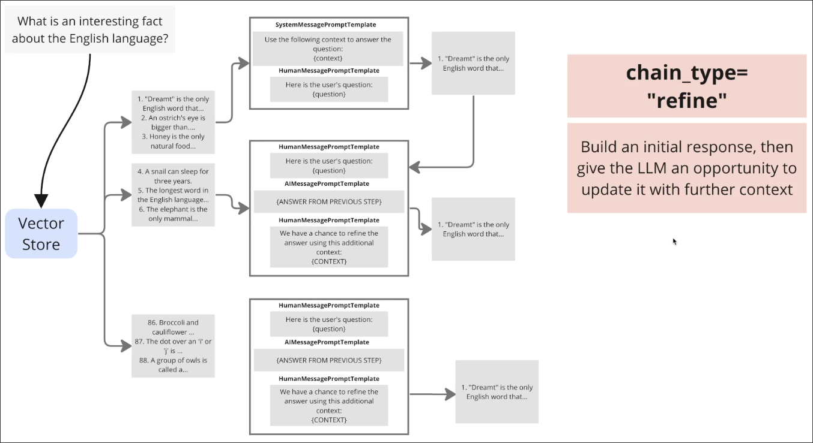

# Understanding Refine

[[2025-01-29_Understanding-map_reduce-chain-type|MapReduce]] and [[2025-01-30_Understanding-MapRerank|MapRerank]] both run several maps at the same time, but the `Refine` is different. It runs each map sequentially, one after the other. 



As shown in the above figure, it sequentially uses the data from each chunk to refine the previous answer until the final result is obtained.

## Coding Example

```python
from typing import List, TypedDict
from langchain_core.documents import Document
from langchain_openai import OpenAIEmbeddings, ChatOpenAI
from langchain_chroma import Chroma
from langchain_core.prompts import ChatPromptTemplate
from langchain_core.output_parsers import StrOutputParser
from langgraph.graph import END, START, StateGraph
from langchain.schema.runnable import RunnableConfig
import argparse

class GraphState(TypedDict):
    query: str
    retrieved_documents: List[Document]
    current_answer: str
    final_answer: str

def create_retriever():
    embeddings = OpenAIEmbeddings(model="text-embedding-3-large")
    db = Chroma(
        embedding_function=embeddings,
        persist_directory="emb"
    )
    return db.as_retriever()

def retrieve(state: GraphState):
    retriever = create_retriever()
    documents = retriever.invoke(state['query'])
    return { 'retrieved_documents': documents }

def refine_answer(state: GraphState):
    llm = ChatOpenAI(model="gpt-4o-mini")
    
    if not state.get('current_answer'):
        first_prompt = ChatPromptTemplate.from_messages([
            ("system", """
            You are an expert researcher. Your task is to:
            1. Carefully read the first context document
            2. Provide a comprehensive initial answer to the question
            3. Ensure your answer is based solely on the information in this context
            """),
            ("human", """
            Question: {query}
            Context: {context}

            Please provide an initial detailed answer based on this context.
            """)
        ])
        
        first_doc = state['retrieved_documents'][0]
        
        chain = (
            first_prompt
            | llm
            | StrOutputParser()
        )
        
        initial_answer = chain.invoke({
            "context": first_doc.page_content,
            "query": state['query']
        })
        
        return {
            'current_answer': initial_answer,
            'retrieved_documents': state['retrieved_documents'][1:]
        }
    
    else:
        refine_prompt = ChatPromptTemplate.from_messages([
            ("system", """
            You are an expert researcher refining an answer. Your task is to:
            1. Review the current answer
            2. Use the new context to improve or correct the answer
            3. If the new context provides additional relevant information, incorporate it
            4. If the new context contradicts the current answer, adjust accordingly
            5. Maintain the overall coherence and accuracy of the answer
            """),
            ("human", """
            Current Answer: {current_answer}
            
            Question: {query}
            New Context: {context}

            Refine the current answer using this new context.
            """)
        ])
        
        current_doc = state['retrieved_documents'][0]
        
        chain = (
            refine_prompt
            | llm
            | StrOutputParser()
        )
        
        refined_answer = chain.invoke({
            "current_answer": state['current_answer'],
            "context": current_doc.page_content,
            "query": state['query']
        })
        
        remaining_docs = state['retrieved_documents'][1:]
        
        return {
            'current_answer': refined_answer,
            'retrieved_documents': remaining_docs
        }

def finalize_answer(state: GraphState):
    return { 'final_answer': state['current_answer'] }

def create_refine_graph():
    workflow = StateGraph(GraphState)
    
    workflow.add_node("retrieve", retrieve)
    workflow.add_node("refine", refine_answer)
    workflow.add_node("finalize", finalize_answer)
    
    workflow.add_edge(START, "retrieve")
    workflow.add_edge("retrieve", "refine")
    
    workflow.add_conditional_edges(
        "refine", 
        lambda state: "finalize" if len(state['retrieved_documents']) == 0 else "refine",
        {
            "refine": "refine",
            "finalize": "finalize"
        }
    )
    
    workflow.add_edge("finalize", END)
    
    return workflow.compile()

def main():
    parser = argparse.ArgumentParser()
    parser.add_argument("--query", required=True, help="Query to search and summarize")
    args = parser.parse_args()

    graph = create_refine_graph()
    
    try:
        config: RunnableConfig = {"configurable": {"thread_id": "unique_thread"}}
        result = graph.invoke({"query": args.query}, config)
        
        print("Final Answer:")
        print(result['final_answer'])
    
    except Exception as e:
        print(f"An error occurred during execution: {str(e)}")

if __name__ == "__main__":
    main()

```

## Downside

When executing certain maps, the chunk data used may have no relation to the query. In such cases, requesting LLM to use this data for refinement may result in generating answers that are completely unrelated to the original query.

Therefore, the design of the prompt is very important, it should inform the LLM that if the new context is not highly relevant to the query, there is no need to use this context to refine the answer.


