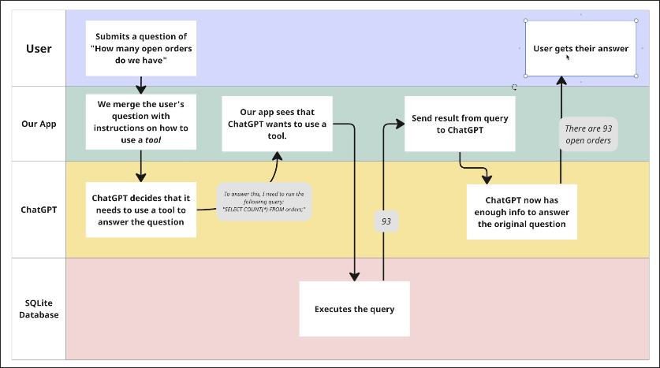

# Understanding Tools

Instead of merging some retrieved documents to the prompt, there is another way for the AI model to actively use tools to solve the problem.

```md
💬:
How many open orders do we have?

🤖:[ChatClaude-3-5-Sonnet]
I apologize, but I don't have access to any specific order information or database for your business. To answer this question accurately, I would need more context about:

1. What kind of business or system you're referring to
2. What time period you're asking about (e.g. current open orders, or within a certain date range)
3. Access to the relevant order management system or database

Without this information, I can't provide an accurate count of open orders. If you have access to this data, you might be able to check your order management system or consult with your sales or operations team to get the current number of open orders.

Is there any additional context you can provide that might help me assist you better with this question?
```

It is obvious that the AI model does not know how to answer this question, but it knows that it needs more information to answer it.

Assuming there is an app layer between the user and the AI model that provides tools for the AI model to use, this tool can query the database through this app to obtain data, so the AI model can answer the question.

```md
💬:
_App Layer merge below instruction into user message_
You have access the following tools:

- run_query: runs a sqlite query and returns a result, accepts a argument of a sql query as a string

_Real User Message (from user input)_
How many open orders do we have?

🤖:[ChatClaude-3-5-Sonnet]
To answer this question, I'll need to query the database using the run_query tool. However, before I do that, I need to make some assumptions and ask for clarification:

1. I'm assuming there's a table in the database that stores order information.
2. I'm assuming "open orders" refers to orders that haven't been completed or cancelled.

Before I proceed, I should ask for clarification:

Can you provide more information about the database structure? Specifically:

1. What is the name of the table that contains order information?
2. Is there a column that indicates the status of an order (e.g., 'open', 'closed', 'cancelled')?
3. How are open orders defined in this system? Is it by a specific status, or is there another way to determine if an order is open?

Once I have this information, I'll be able to construct an accurate SQL query to count the number of open orders.
```

The AI model now knows that it can use the `run_query` tool to query the database but needs more information to construct the query. Our app is hard to understand this kind of response, so we should restrict the AI model to use the `run_query` tool with a app-known language.

```md
💬:
You have access the following tools:

- run_query: runs a sqlite query and returns a result, accepts a argument of a sql query as a string

_To restrict the AI model to use the `run_query` tool with a JSON format response because the app can understand this format_
To use a tool always respond with the following format:

{
"name": <name of tool to use>,
"argument": <argument to pass to the tool>
}

How many open orders do we have?

🤖:[ChatClaude-3-5-Sonnet]

{
"name": "run_query",
"argument": "SELECT name FROM sqlite_master WHERE type='table' AND name LIKE '%order%';"
}
```

Now, the app can understand the response from the AI model and execute the query to get the number of open orders.

> **Note:** The AI model decides whether to use the tool on its own.

Assuming the query result is 98, send it directly to the AI model.

```md
💬:
You have access the following tools:

- run_query: runs a sqlite query and returns a result, accepts a argument of a sql query as a string

To use a tool always respond with the following format:

{
"name": <name of tool to use>,
"argument": <argument to pass to the tool>
}

How many open orders do we have?

🤖:[ChatClaude-3-5-Sonnet]
{
"name": "run_query",
"argument": "SELECT COUNT(\*) AS open_orders FROM orders WHERE status = 'open';"
}

💬:
98

🤖:[ChatClaude-3-5-Sonnet]
Based on the query result, we have 98 open orders.
```

The AI model obtained the answer from the app layer above and responded to the user's question.

The above is a complete process for an AI model to use app layer tools, visualized as shown in the diagram below.



In modern AI models, there are some advanced options that can be directly used without the need to merge some prompts from the app layer as in the example above. Our next topic will explain how to use these options to achieve the same effect as the process above.
