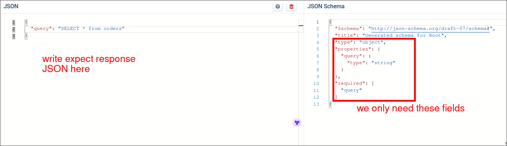

# Understanding ChatGPT Functions

In [[2025-01-30_Understanding-Tools|Understanding Tools]], we put directions into the prompt directly, it produces the following downsides:

1. More complex directions, more expenisve

2. LLMs do not always response JSON, especially using Chat model

To solve above problems, ChatGPT provides ChatGPT Functions.

With ChatGPT Functions, you should request the model with the below format:

```py
messages = [  # regular messages
    {"role": "user", "content": "How many open orders are there?"}
]
functions = [ # list of functions
    {
        "name": "run_query",
        # ChatGPT mainly uses this description to understand the function
        "description": "Run a sql query. Returns the result",
        "parameters": {
            # this is following the JSON schema
            "type": "object",
            "properties": {
                "query": {
                    "type": "string",
                    "description": "The SQL query to execute"
                }
            }
        }
    }
]

```

The most important thing in the above request is the `JSON schema`, we can google `JSON schema` to find tool websites to help us generate `JSON schema`.
[Json to Json Schema](https://transform.tools/json-to-json-schema)



Then, LLMs will response the result in JSON format.

```json
{
  "messages": [
    {
      "role": "assistant",
      "function_call": {
        "name": "run_query",
        "arguments": {
          "query": "SELECT COUNT(*) FROM orders WHERE status = 'open'"
        }
      }
    }
  ]
}
```

When our app receives the response, it should execute the query to get the result from the database. Then, return the result to the LLMs.

```py
messages = [
    # write all the messages before
    {"role": "user", "content": "How many open orders are there?"},
    {
        "role": "assistant",
        "function_call": {
            "name": "run_query",
            "arguments": {
                "query": "SELECT COUNT(*) FROM orders WHERE status = 'open'"
            }
        }
    },
    # returns the query result as a new message
    {"role": "function", "content": "93"}
]
# function list is always put at the end
functions = [
    {
        "name": "run_query",
        "description": "Run a sql query. Returns the result",
        "parameters": {
            "type": "object",
            "properties": {
                "query": {
                    "type": "string",
                    "description": "The SQL query to execute"
                }
            }
        }
    }
]
```

Here is an example of using ChatGPT Functions. If other AI models do not provide Functions functionality, we can still use the approach of [[2025-01-30_Understanding-Tools|Understanding Tools]], but it is better to use a completion model for processing.
