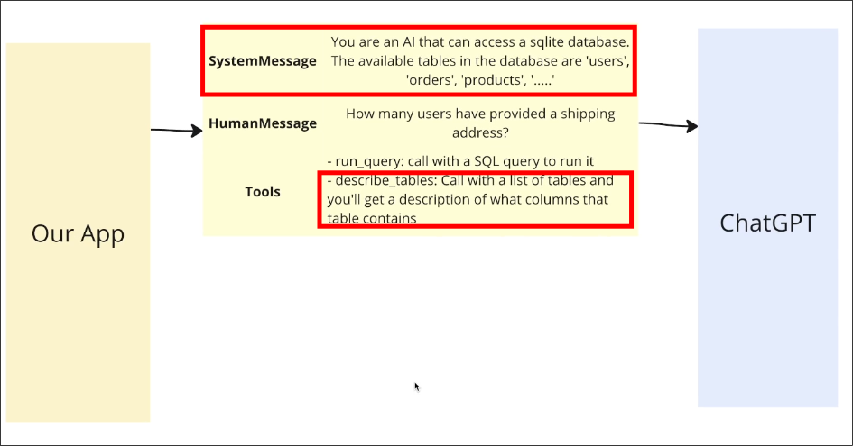

# Adding Table Context

In [[2025-01-31_Recovering-from-Errors-in-Tools|Recovering from Errors in Tools]], we sent the error message of tools to the LLM, but it was not enough. We should also send the context of our database schema to the LLM.

To do this, we use system message and more tools as follows:


Somebody might ask, "Why do we just send the complete schema (table names and table columns) in system message?"

The answer is that if we send too much context in the system message, LLMs might be overwhelmed. We should send the minimum context that is necessary.

In this topic, we will only implement the system message part to our two styles of applications.

## Both LangChain and Pure LangChain Applications

File: /home/matt/Projects/pycode/tools/sql.py

```python
import sqlite3
from langchain_core.tools import tool

# We add a new tool to list all tables in the database.
@tool
def list_tables():
    """List all tables in the database."""
    conn = sqlite3.connect('db.sqlite')
    cursor = conn.cursor()
    try:
        cursor.execute("SELECT name FROM sqlite_master WHERE type='table';")
        rows = cursor.fetchall()
        return "\n".join(row[0] for row in rows if row[0] is not None)
    except sqlite3.OperationalError as e:
        return f"The following error occurred: {str(e)}."
    finally:
        conn.close()

@tool
def run_sqlite_query(query: str):
    """Run a sqlite query."""
    conn = sqlite3.connect('db.sqlite')
    cursor = conn.cursor()
    try:
        cursor.execute(query)
        return cursor.fetchall()
    except sqlite3.OperationalError as e:
        return f"The following error occurred: {str(e)}. You can try again with a different query.(at most 10 times)"
    finally:
        conn.close()
```

## Pure LangChain Application

File: /home/matt/Projects/pycode/main.py

```python
from typing import List
from langchain_core.messages import AIMessage, HumanMessage, SystemMessage, ToolMessage, BaseMessage
from langchain_openai import ChatOpenAI

from tools.sql import list_tables, run_sqlite_query

llm = ChatOpenAI(model="gpt-4o-mini")
llm_with_tools = llm.bind_tools([run_sqlite_query])

# Get the list of tables in the database. And because we wrapped the function as a tool, we can call it with invoke.
tables = list_tables.invoke("")

messages: List[BaseMessage] = [

    # We send the list of tables in the database as a system message.
    SystemMessage(content=f"You are an AI that has access to a SQLite database.\n{tables}"),

    HumanMessage(content="How many users provide shipping address?")
]
max_iterations = 10

for i in range(max_iterations):
    print(f"\nIteration {i + 1}:")
    response = llm_with_tools.invoke(messages)
    messages.append(response)

    if isinstance(response, AIMessage) and response.tool_calls:
        for tool_call in response.tool_calls:
            print(f"Executing query: {tool_call['args']['query']}")
            tool_output = run_sqlite_query.invoke(tool_call['args'])
            tool_message = ToolMessage(
                content=str(tool_output),
                tool_call_id=tool_call['id'],
                name=tool_call['name']
            )
            messages.append(tool_message)
            print(f"Query result: {tool_output}")
    else:
        print("Final answer:", response.content)
        break
else:
    print("Maximum iterations reached without a final answer.")

```

```sh
 python main.py

Iteration 1:
Executing query: SELECT COUNT(DISTINCT user_id) as user_count FROM addresses WHERE
Query result: The following error occurred: no such column: shipping_address. You c

Iteration 2:
Executing query: SELECT COUNT(DISTINCT user_id) as user_count FROM addresses;
Query result: [(2000,)]

Iteration 3:
Final answer: There are 2,000 users who provide a shipping address.
```

You can see that LLMs give the answer with fewer iterations because they have the context of the database schema.

## LangChain Application

File: /home/matt/Projects/pycode/main1.py

```python
from typing import Annotated, TypedDict
from langchain_openai import ChatOpenAI
from langgraph.graph import StateGraph, END
from langgraph.prebuilt import ToolNode
from langgraph.graph.message import add_messages
from langchain_core.messages import AIMessage

from tools.sql import list_tables, run_sqlite_query


class AgentState(TypedDict):
    messages: Annotated[list, add_messages]

tools = [run_sqlite_query]
llm = ChatOpenAI(model="gpt-4o-mini")
llm_with_tools = llm.bind_tools(tools)

# Get the list of tables in the database. And because we wrapped the function as a tool, we can call it with invoke.
tables = list_tables.invoke("")

def call_model(state: AgentState):
    messages = state['messages']
    response = llm_with_tools.invoke(messages)
    return {"messages": [response]}

tool_node = ToolNode(tools)

def should_continue(state: AgentState):
    last_message = state['messages'][-1]
    if isinstance(last_message, AIMessage) and last_message.tool_calls:
        return "tools"
    return END

workflow = StateGraph(AgentState)
workflow.add_node("model", call_model)
workflow.add_node("tools", tool_node)

workflow.set_entry_point("model")
workflow.add_conditional_edges(
    "model",
    should_continue,
    {
        "tools": "tools",
        END: END
    }
)
workflow.add_edge("tools", "model")

app = workflow.compile()

initial_input = {"messages": [

    # We send the list of tables in the database as a system message.
    {"role": "system", "content": f"You are an AI that has access to a SQLite database.\n{tables}"},

    {"role": "human", "content": "How many users provide shipping address?"}
]}

result = app.invoke(initial_input)

print(result['messages'][-1].content)
```

```sh
 python main1.py
There are 2000 users who have provided a shipping address.
```
