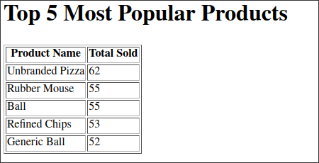

# Tools with Multiple Arguments

We want to create a new tool that can let LLMs write HTML files.

In the old version of LangChain, due to legacy issues, it's needed to be changed from `Tool` to `StructuredTool` in order to define tools with multiple parameters.

However, in the new version of LangChain, `@tool` can directly define tools with multiple parameters.


## Create a new tool that writes an HTML file

File: /home/matt/Projects/pycode/tools/report.py
```python
from langchain_core.tools import tool

@tool
def write_report(filename: str, html: str):
    """Write an HTML file to disk. Use this tool whenever someone asks for a report."""
    with open(filename, "w") as f:
        f.write(html)
    return f"Report written to {filename}."
```


## Implement it in the pure LangChain app

File: /home/matt/Projects/pycode/main.py
```python
from typing import List
from langchain_core.messages import AIMessage, HumanMessage, SystemMessage, ToolMessage, BaseMessage
from langchain_openai import ChatOpenAI

from tools.report import write_report # Import the new tool
from tools.sql import describe_tables, list_tables, run_sqlite_query

llm = ChatOpenAI(model="gpt-4o-mini")
llm_with_tools = llm.bind_tools([
    run_sqlite_query,
    describe_tables,
    write_report # Bind the new tool
])

tables = list_tables.invoke("")

messages: List[BaseMessage] = [
    SystemMessage(content=(
        "You are an AI that has access to a SQLite database.\n"
        f"The database has tables of: {tables}.\n"
        "Do not make any assumptions about what tables exist "
        "or what columns exist. Instead, use the 'describe_tables' function"
    )),
    HumanMessage(content="Summarize the top 5 most popular products. Write the results to a report file."),
    #                     ^^^^^^^^^^^^^^^^^^^^^^^^^^^^^^^^^^^^^^^^^^^^^^^^^^^^^^^^^^^^^^^^^^^^^^^^^^^^^^
    #                     ask the AI to write a report
]
max_iterations = 10

for i in range(max_iterations):
    print(f"\nIteration {i + 1}:")
    response = llm_with_tools.invoke(messages)
    messages.append(response)

    if isinstance(response, AIMessage) and response.tool_calls:
        for tool_call in response.tool_calls:
            if tool_call['name'] == "run_sqlite_query":
                print(f"Executing query: {tool_call['args']['query']}")
                tool_output = run_sqlite_query.invoke(tool_call['args'])
            elif tool_call['name'] == "describe_tables":
                print(f"Describing tables: {tool_call['args']['table_names']}")
                tool_output = describe_tables.invoke(tool_call['args'])
            # Add a new branch for the new tool
            else:
                print("Write report...")
                tool_output = write_report.invoke(tool_call['args'])

            tool_message = ToolMessage(
                content=str(tool_output),
                tool_call_id=tool_call['id'],
                name=tool_call['name']
            )
            messages.append(tool_message)
            print(f"Query result: {tool_output}")
    else:
        print("Final answer:", response.content)
        break
else:
    print("Maximum iterations reached without a final answer.")

```
Let's run the code and see the result.

```bash
 python main.py

Iteration 1:
Describing tables: ['products', 'order_products']
Query result: CREATE TABLE products (
    id INTEGER PRIMARY KEY,
    name TEXT,
    price REAL
    )
CREATE TABLE order_products (
    id INTEGER PRIMARY KEY,
    order_id INTEGER,
    product_id INTEGER,
    amount INTEGER
    )

Iteration 2:
Executing query: SELECT p.name, SUM(op.amount) AS total_sold 
FROM products p 
JOIN order_products op ON p.id = op.product_id 
GROUP BY p.id 
ORDER BY total_sold DESC 
LIMIT 5;
Query result: [('Unbranded Pizza', 62), ('Rubber Mouse', 55), ('Ball', 55), ('Re

Iteration 3:
Write report...
Query result: Report written to top_5_popular_products.html.

Iteration 4:
Final answer: The report on the top 5 most popular products has been created suc

Here are the details:

1. **Unbranded Pizza** - Total Sold: 62
2. **Rubber Mouse** - Total Sold: 55
3. **Ball** - Total Sold: 55
4. **Refined Chips** - Total Sold: 53
5. **Generic Ball** - Total Sold: 52

You can access the report for more information. 
```


## Implement it in the LangGraph app

File: /home/matt/Projects/pycode/main1.py
```python
from typing import Annotated, TypedDict
from langchain_openai import ChatOpenAI
from langgraph.graph import StateGraph, END
from langgraph.prebuilt import ToolNode
from langgraph.graph.message import add_messages
from langchain_core.messages import AIMessage
from langgraph.errors import GraphRecursionError

from tools.report import write_report # Import the new tool
from tools.sql import describe_tables, list_tables, run_sqlite_query

MAX_RECURSION_LIMIT = 10

class AgentState(TypedDict):
    messages: Annotated[list, add_messages]
    recursion_count: int

tools = [run_sqlite_query, describe_tables, write_report]
#                                           ^^^^^^^^^^^^ Bind the new tool
llm = ChatOpenAI(model="gpt-4o-mini")
llm_with_tools = llm.bind_tools(tools)

tables = list_tables.invoke("")

def call_model(state: AgentState):
    messages = state['messages']

    last_message = messages[-1]
    if last_message.name in ["run_sqlite_query", "describe_tables"]:
        print('Query result:', last_message.content)
        print('\n')

    response = llm_with_tools.invoke(messages)
    return {"messages": [response]}

tool_node = ToolNode(tools)

def should_continue(state: AgentState):
    last_message = state['messages'][-1]
    if isinstance(last_message, AIMessage) and last_message.tool_calls:
        print(f"Iteration {state['recursion_count'] + 1}:")
        for tool_call in last_message.tool_calls:
            if tool_call['name'] == "run_sqlite_query":
                print(f"Executing query: {tool_call['args']['query']}")
            elif tool_call['name'] == "describe_tables":
                print(f"Describing tables: {tool_call['args']['table_names']}")
            # Add a new branch for the new tool
            else:
                print("Write report...")

        return "tools"
    return END

def update_recursion_count(state: AgentState):
    current_count = state.get('recursion_count', 0)

    if current_count >= MAX_RECURSION_LIMIT:
        raise GraphRecursionError(f"Maximum recursion limit of {MAX_RECURSION_LIMIT} reached")

    return {"recursion_count": current_count + 1}

workflow = StateGraph(AgentState)
workflow.add_node("model", call_model)
workflow.add_node("tools", tool_node)
workflow.add_node("increment_recursion", update_recursion_count)

workflow.set_entry_point("model")
workflow.add_conditional_edges(
    "model", 
    should_continue, 
    {
        "tools": "increment_recursion",
        END: END
    }
)
workflow.add_edge("increment_recursion", "tools")
workflow.add_edge("tools", "model")

app = workflow.compile()

initial_input = {
    "messages": [
        {
            "role": "system",
            "content": (
                "You are an AI that has access to a SQLite database.\n"
                f"The database has tables of: {tables}.\n"
                "Do not make any assumptions about what tables exist "
                "or what columns exist. Instead, use the 'describe_tables' function"
            )
        },
        {"role": "human", "content": "Summarize the top 5 most popular products. Write the results to a report file."}
        #                             ^^^^^^^^^^^^^^^^^^^^^^^^^^^^^^^^^^^^^^^^^^^^^^^^^^^^^^^^^^^^^^^^^^^^^^^^^^^^^^
        #                             ask the AI to write a report
    ],
    "recursion_count": 0
}

try:
    result = app.invoke(initial_input)
    print(result['messages'][-1].content)

except GraphRecursionError:
    print("Maximum recursion limit reached.")

```

Let's run the code and see the result.

```bash
 python main1.py
Iteration 1:
Describing tables: ['products', 'order_products']
Query result: CREATE TABLE products (
    id INTEGER PRIMARY KEY,
    name TEXT,
    price REAL
    )
CREATE TABLE order_products (
    id INTEGER PRIMARY KEY,
    order_id INTEGER,
    product_id INTEGER,
    amount INTEGER
    )


Iteration 2:
Executing query: SELECT p.name, SUM(op.amount) as total_sold
FROM products p
JOIN order_products op ON p.id = op.product_id
GROUP BY p.id
ORDER BY total_sold DESC
LIMIT 5;
Query result: [["Unbranded Pizza", 62], ["Rubber Mouse", 55], ["Ball", 55], ["Refined Chips", 53], ["Generic Ball", 52]]


Iteration 3:
Write report...
The report summarizing the top 5 most popular products has been successfully created and written to the file **top_5_popular_products.html**. Here are the
 details included in the report:

1. **Unbranded Pizza** - 62 sold
2. **Rubber Mouse** - 55 sold
3. **Ball** - 55 sold
4. **Refined Chips** - 53 sold
5. **Generic Ball** - 52 sold

If you need further assistance, feel free to ask!
```

## Check the HTML file


