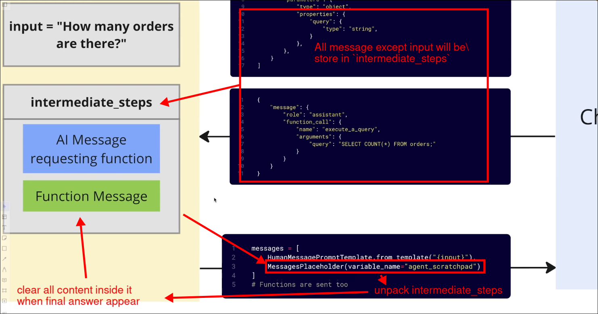
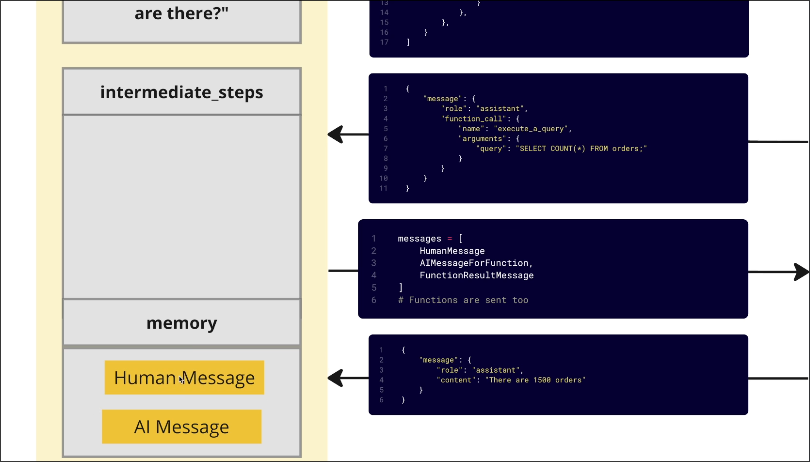

# Memory vs Agent Scratchpad

```py
agent_executor = AgentExecutor(
    agent=agent,
    verbose=True,
    tools=tools
)

agent_executor("How many orders are there?")

agent_executor("Repeat the exact same process for users.")
# this the 2nd question assumes that the agent has the memory of the previous question, but it doesn't

```



`Intermediate_steps` is a variable, in above case, it is named as `agent_scratchpad` which stores the intermediate steps of the agent.


Even we use memory to agents, it only stores the initial human question and final agent response. It doesn't store the intermediate steps.




