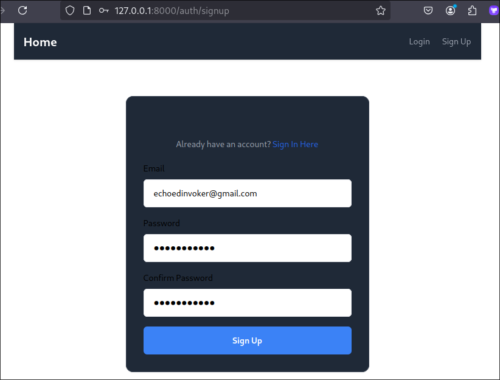
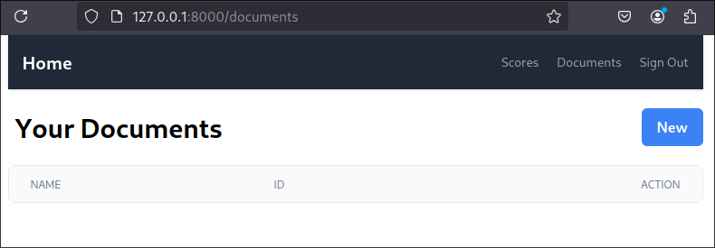

# Boilerplate Setup

```sh
$ git clone https://github.com/0x-cygnet/langchain-pdf.git pdf
$ cd pdf
$ pipenv install # install dependencies
$ pipenv shell # activate virtual environment
$ flask --app app.web init-db # initialize database
$ inv dev # run development server at 127.0.0.1:8000
```

Check it on the browser:



Styling doesn't work very well in the Firefox browser. We created a new user and logged in.



Above is the list of PDFs. If we click on the button `New`, some error occurs because this is only starter code. We'll start to implement the functionality in the next topic.
