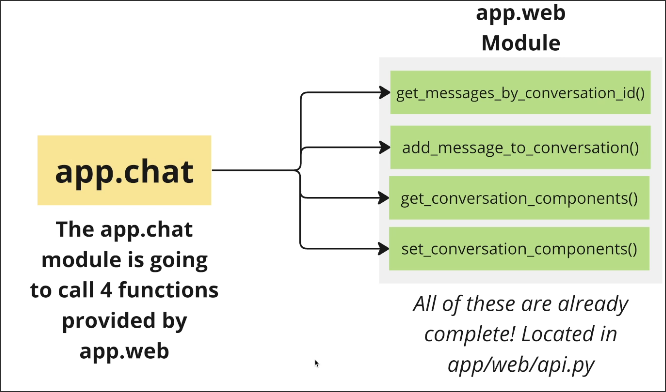
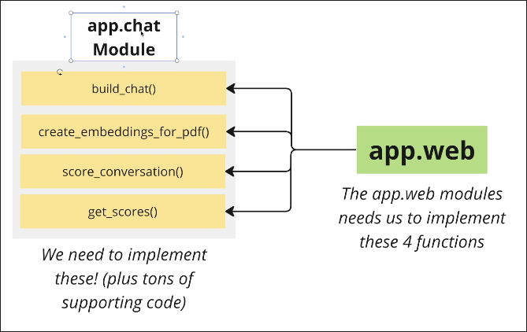

# How This App is Designed

```sh
 tree
.
├── app
│   ├── celery # Config for the 'worker'. More on the worker later!
│   ├── chat # Where we will do 99% of our work. Contains everything for processing pdfs, embeddings, text gen, etc
│   └── web # Server code. Functions to handle requests, database access, etc
├── client # All the HTML, Javascript, styling that shows up in the browser
├── .env # Sets environment variables, just as before
├── .venv # Dependencies and project configuration
├── instance
├── README.md
├── requirements.txt
└── tasks.py # Defines some shortcut commands to run the server (like "inv dev")
```

We basically only focus on the two modules, app.chat and app.web.

**app.web**
Almost done. Contains mostly web-dev stuff.

**app.chat**
We need to build this module.


## How app.web and app.chat Interact

1. **app.chat** is going to call 4 functions provided by **app.web**:



These functions are already completed in **app.web**. We just need to call them from **app.chat** at the right time.

2. **app.web** will call 4 functions provided by **app.chat**:


**app.web** already has these functions` calling code but the functions themselves are not implemented yet. We need to implement them in **app.chat**.

For **app.chat**, not only these 4 functions, there are many other functions that we need to implement to support the 4 functions above.


