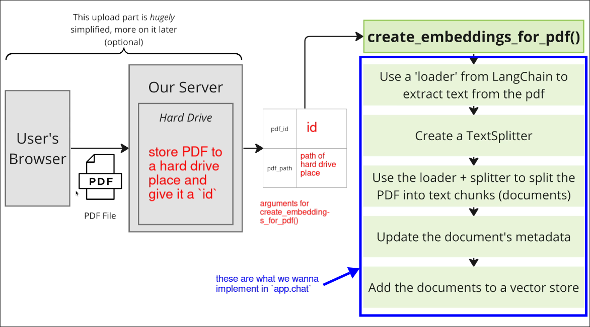

# Outlining the First Feature

We'll implement the first exposed function of `app.chat` module.

File: /home/matt/Projects/pdf/app/chat/create_embeddings.py
```python
def create_embeddings_for_pdf(pdf_id: str, pdf_path: str):
    """
    Generate and store embeddings for the given pdf

    1. Extract text from the specified PDF.
    2. Divide the extracted text into manageable chunks.
    3. Generate an embedding for each chunk.
    4. Persist the generated embeddings.

    :param pdf_id: The unique identifier for the PDF.
    :param pdf_path: The file path to the PDF.

    Example Usage:

    create_embeddings_for_pdf('123456', '/path/to/pdf')
    """

    pass

```

When users upload a PDF though the `app.web` module, `app.web` will call `app.chat.create_embeddings_for_pdf` to split the PDF into chunks and generate embeddings for each chunk. The embeddings will be stored in the database.


The blue part is actually the same process we have done in the previous topic (except for updating the document's metadata), but this time we will use vector storage other than chroma.


