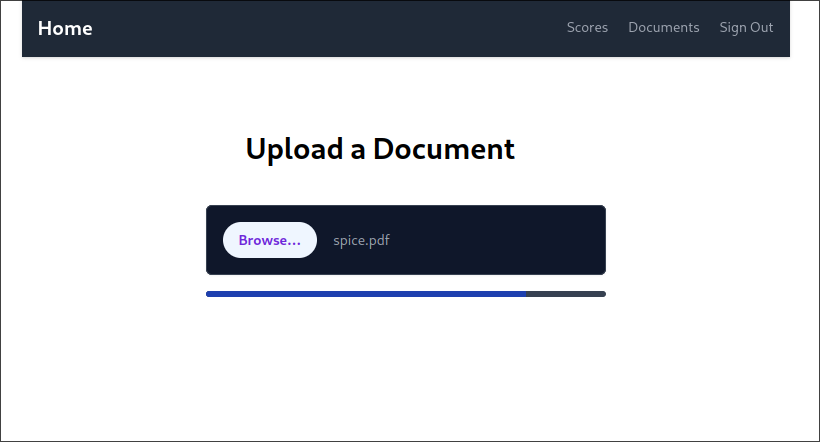
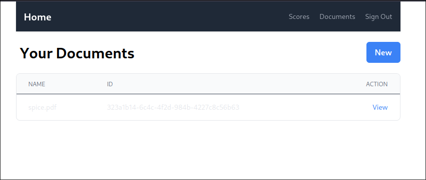
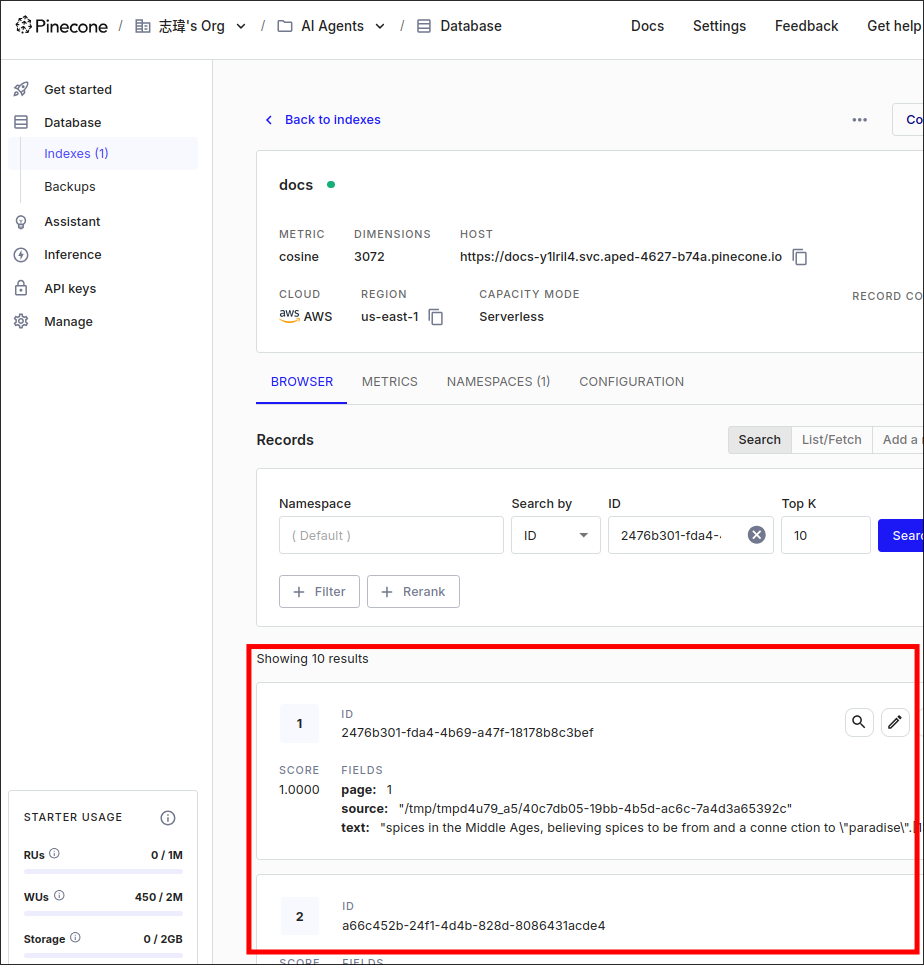

# Adding Documents to the Vector Store


## Adding Documents to the Vector Store in codes

In [[2025-02-06_Initialize-the-Pinecone-Client|the previous topic]], we created a vector storage object with Pinecone client. Now, we can complete the function `create_embeddings_for_pdf` in [[2025-02-04_Loading-and-Splitting-From-a-PDF|this topic]]. We will generate embeddings for each document and store them in the vector store.

File: /home/matt/Projects/pdf/app/chat/create_embeddings.py
```python
from langchain.document_loaders import PyPDFLoader
from langchain.text_splitter import RecursiveCharacterTextSplitter
from app.chat.vector_stores.pinecone import vector_store # import the vector store

def create_embeddings_for_pdf(pdf_id: str, pdf_path: str):
    text_splitter = RecursiveCharacterTextSplitter(
        chunk_size=500,
        chunk_overlap=100
    )

    loader = PyPDFLoader(pdf_path)
    docs = loader.load_and_split(text_splitter)

    # Add the documents to the vector store, it'll automatically create embeddings for them
    vector_store.add_documents(docs)

```


## Uplaoading Documents to the Vector Store on our web app interface

Then, we can try to upload a PDF file to the vector store on the browser.



It'll stuck at about 70~80% for a while (about 20 seconds), we need to fix this issue in the future.




## Checking the uploaded documents on the Pinecone dashboard

We can see the uploaded documents on the Pinecone dashboard.



Let's check the metadata of the uploaded documents:

`page` means the PDF page number, where the document is from.
`source` means where the disk place the document is from. But it's usually a temporary file path, so it's not very useful for us.
`text` is the text content of the chunk corresponding to the embedding.

We can optimize the performance of uploading documents by mutating the metadata of the documents. We'll do this in the next topic.


