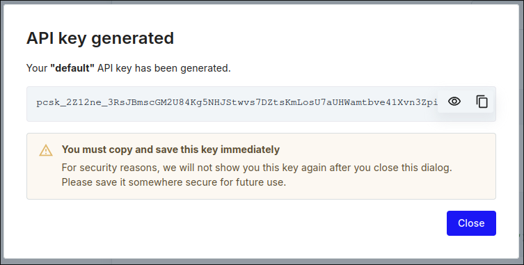
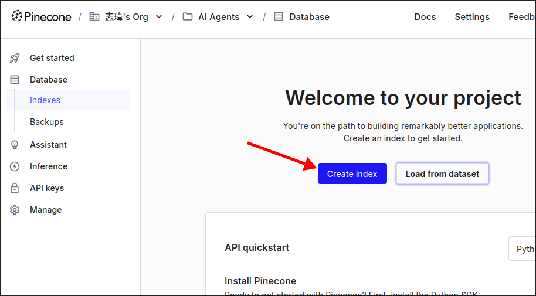

# Introducing Pinecone

After [[2025-02-04_Loading-and-Splitting-From-a-PDF|Loading and Splitting From a PDF]], we left the last step of [[2025-02-04_Outlining-the-First-Feature|Outlining the First Feature]] - saving the embeddings to a vectory database. In this topic, we will introduce Pinecone, a vector database that will be used to store the embeddings generated from the PDFs.

pinecone.io is a production-ready hosted vector database. This means that the database is hosted on someone else's server, not on one's own server.

There are some steps to follow to use Pinecone:

**Step 1: Sign up for an account**

When you first sign up, Pinecone will generate a default API key for you, just copy it and save it in your .env file.



**Step 2: Create an index and get an API key**

index = database




`Dimension` is critical. You need to know the dimension of your embeddings model. In our case, we are using the openai embeddings model, which has a dimension of 1536.

**Step 3: Add environment variables to .env file**

File: /home/matt/Projects/pdf/.env

```sh
SECRET_KEY=123
SQLALCHEMY_DATABASE_URI=sqlite:///sqlite.db
UPLOAD_URL=https://prod-upload-langchain.fly.dev

OPENAI_API_KEY=sk-proj-gCy... # OpenAI API Key

REDIS_URI=

PINECONE_API_KEY=pcsk_2Z12n... # Pinecone API Key
PINECONE_ENV_NAME=us-east-1 # Pinecone index region
PINECONE_INDEX_NAME=docs # Pinecone index name

LANGFUSE_PUBLIC_KEY=
LANGFUSE_SECRET_KEY=
```

**Step 4: Install the Pinecone client and wrap it up with LangChain**

**Step 5: Create a client and wrap it up with LangChain**

We'll do the step 4 and 5 in the following topics.


