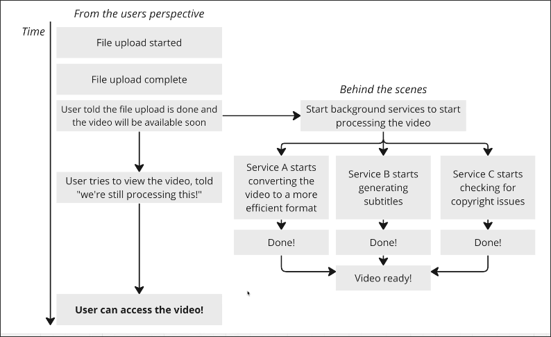
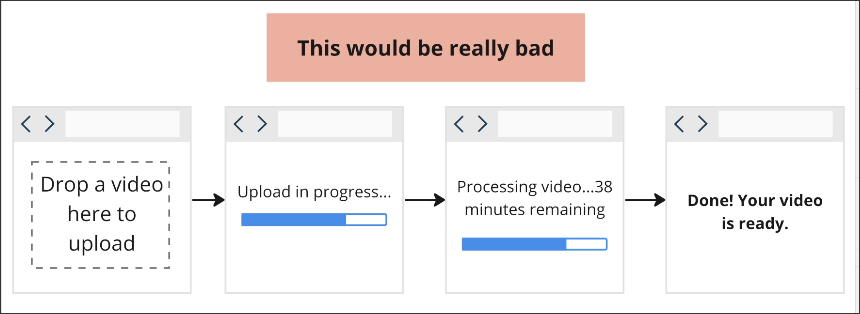
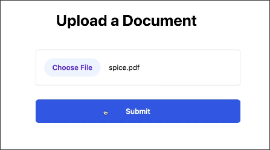
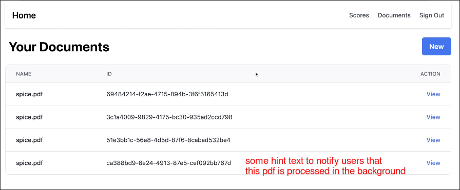

# Why is Processing Taking Forever?

In [[2025-02-06_Adding-Documents-to-the-Vector-Store|Adding Documents to the Vector Store]], uploading a PDF file to the vector store stucked at about 70~80% for a while (about 20 seconds). We need to fix that in this topic.

## Reason of the Issue

The reason for being stuck at 70~80 is because the vector storage object needs to use OpenAI's embedding model to generate embeddings. This process is time-consuming, and it is not until all documents have generated embeddings that they will truly be uploaded to Pinecone's index.

## How to Fix

Generating embeddings quickly is very difficult because it is limited by the speed of OpenAI's API, but we can optimize the user experience. The best learning example is the process of uploading videos on YouTube.

## Imagine the process of uploading a video on YouTube

The key point is that the prompt *File upload complete* appears before processing the video-related processes, allowing users to know they can close the browser, but the video will still be processed on the YouTube server.

## Imagine *File upload complete* not appearing until the video processing is done...

This will make the user uploading videos directly a disaster, as they can only choose to stare at the progress bar until the video is completely processed, this kind of user experience is very bad.

## So, what can we do for our PDF uploading process?

After the user uploads a PDF, we will immediately redirect them to the list page of PDFs, so that they are aware that they can close the webpage, but the PDFs will still be generating embeddings in the background and uploading to the Pinecone index.

After user clicks the *Submit* button, they will be redirected to the list page of PDFs immediately.

