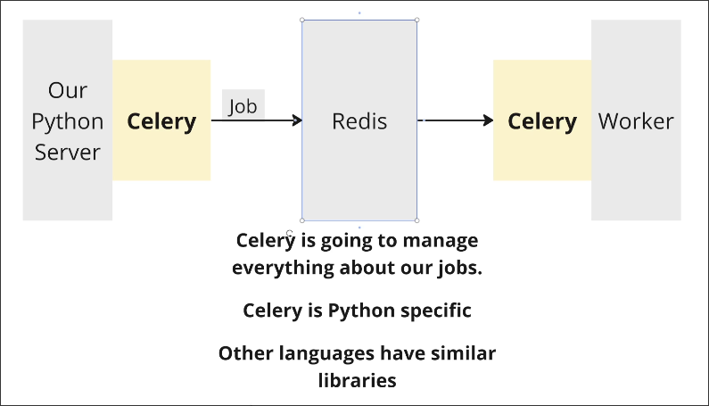

# Redis Setup

Our application already uses `Celery` to handle jobs to workers as below:



`Celery` can implement the pattern [[2025-02-06_Introducing-Background-Jobs|background jobs]] extremely easily and straightforwardly.

`Celery` need to attach to our python servers and workers to handle the jobs.

However, we still need to create a message broker (which in case is Redis) on our own. (It's very easy for linux... so I just skip this part of note)

Launch the redis server:
```sh
$ redis-server
```

And then, add redis uri to the .env file of our application:

File: /home/matt/Projects/pdf/.env
```sh
SECRET_KEY=123
SQLALCHEMY_DATABASE_URI=sqlite:///sqlite.db
UPLOAD_URL=https://prod-upload-langchain.fly.dev
 
OPENAI_API_KEY=sk-proj-...
 
REDIS_URI=redis://localhost:6379 # this is default uri of redis (local)
 
PINECONE_API_KEY=pcsk_2Z1...
PINECONE_ENV_NAME=us-east-1
PINECONE_INDEX_NAME=docs
 
LANGFUSE_PUBLIC_KEY=
LANGFUSE_SECRET_KEY=
```

Then restart the server to apply the changes.

```sh
$ inv dev
```


