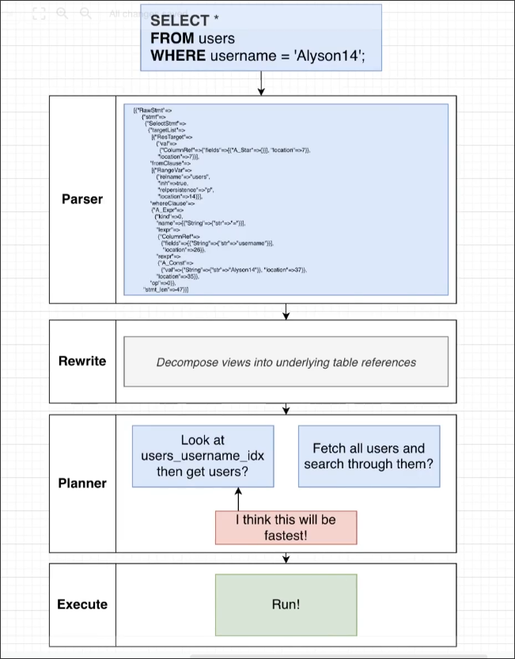

# The Query Processing Pipeline

The query processing pipeline is a sequence of steps that a query goes through before it is executed.

**Parser**
- It parses the query and checks for syntax errors.
- The result of parsing is a query tree, which is a tree representation of the query that the database can understand better.

**Rewriter**
- It is going to take the query tree and possibly make little modifications to it if Postgres thinks it can execute the query more efficiently.
- However, what happens much more frequently is it applies the idea of `views` to the query tree itself.

**Planner**
- It is going to take the query tree, figure out what information you are tring to fetch, and then come up with a series of different plans or strategies that could be used to actually get that information.
- After that, the planner is going to evaluate which one it thinks is going to actually execute the fastest and then choose that plan to actually run.

