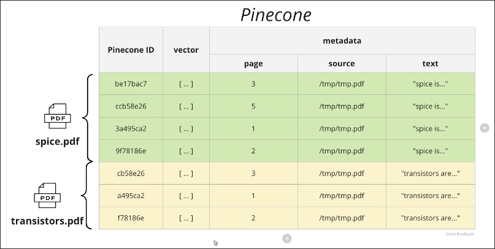
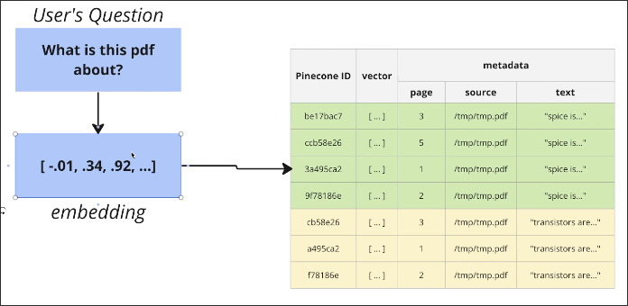
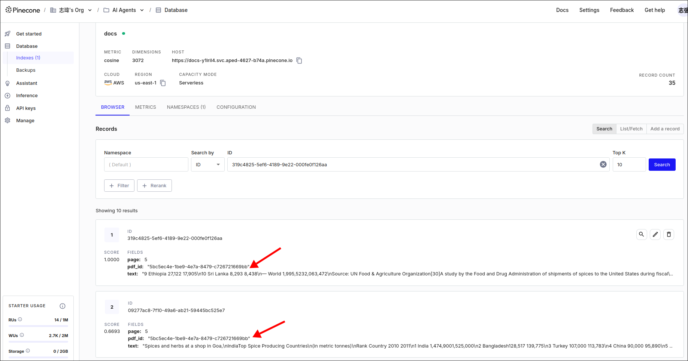

# Updating Document Metadata

When we upload another PDF file, its documents will be stored in the same index of Pinecone.



There is no any information about where the document comes from. If a user asks a question about the spice.pdf, similarity search will return documents mixed from different sources instead of only the documents from the spice.pdf.



To solve this problem, we need to rebuild the metadata of the documents.

File: /home/matt/Projects/pdf/app/chat/create_embeddings.py
```python
from langchain.document_loaders import PyPDFLoader
from langchain.text_splitter import RecursiveCharacterTextSplitter
from app.chat.vector_stores.pinecone import vector_store

def create_embeddings_for_pdf(pdf_id: str, pdf_path: str):
#                             ^^^^^^^^^^^ generated by the database when the PDF is uploaded
    text_splitter = RecursiveCharacterTextSplitter(
        chunk_size=500,
        chunk_overlap=100
    )

    loader = PyPDFLoader(pdf_path)
    docs = loader.load_and_split(text_splitter)

    # Rebuild metadata
    for doc in docs:
        doc.metadata = {
            "page": doc.metadata["page"],
            "text": doc.page_content,
            "pdf_id": pdf_id # <--- Add the pdf_id to the metadata, so we can filter the documents by the pdf_id when we use similarity search
        }

    vector_store.add_documents(docs)

```

Let's restart the application and upload the spice.pdf again. After it, check the documents in the Pinecone index.




