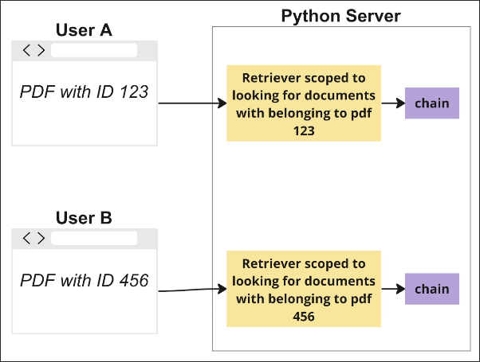
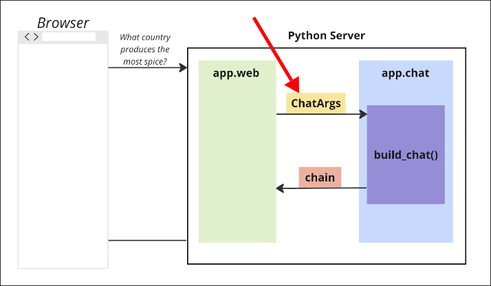

# Building the Retriever

After learning the concepts of how to achieve the requirements of `build_chat()`, we can now start implementing `build_chat()` in codes, the first step is to generate the `retriever` object.

However, we need to consider the situation where multiple users are asking questions about different PDFs at the same time.



Therefore, we need to create a customized retriever for each user so that we can ensure that each user's questions are answered correctly.

In order to achieve this goal, when `app.web` calls `build_chat()`, it will pass an argument of type `ChatArgs`, which includes user id, pdf id, metadata, and streaming flag.



File: /home/matt/Projects/pdf/app/chat/chat.py
```python
from app.chat.models import ChatArgs


def build_chat(chat_args: ChatArgs):
    pass
```

File: /home/matt/Projects/pdf/app/chat/models/__init__.py
```python
from pydantic import BaseModel, Extra


class Metadata(BaseModel, extra=Extra.allow): ...

class ChatArgs(BaseModel, extra=Extra.allow):
    conversation_id: str
    pdf_id: str
    metadata: Metadata
    streaming: bool
```

Then, we can create a support function `build_retriever()` to generate the retriever object based on the `ChatArgs` object and call it in `build_chat()`.

File: /home/matt/Projects/pdf/app/chat/vector_stores/pinecone.py
```python
import os
from langchain_pinecone import PineconeVectorStore
from pinecone import Pinecone
from app.chat.embeddings.openai import embeddings
from app.chat.models import ChatArgs

pc = Pinecone(api_key=os.getenv("PINECONE_API_KEY"))
index_name = os.getenv("PINECONE_INDEX_NAME", 'docs')

index = pc.Index(index_name)

vector_store = PineconeVectorStore(
    index=index, 
    embedding=embeddings
)

# Instead of creating a retriever object here and exporting it,
# we create a function to create a retriever object based on the ChatArgs argument
# so that we can create a customized retriever for each user
def build_retriever(chat_args: ChatArgs):
    return vector_store.as_retriever(
        search_kwargs={"filter": {"pdf_id": chat_args.pdf_id}}
    )
```

File: /home/matt/Projects/pdf/app/chat/chat.py
```python
from app.chat.models import ChatArgs
from app.chat.vector_stores.pinecone import build_retriever


def build_chat(chat_args: ChatArgs):
    retriver = build_retriever(chat_args) # Generate the retriever object with above function we just created
```


