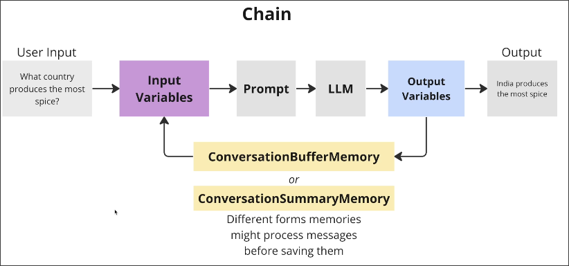
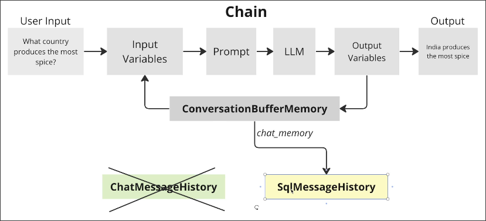

# Custom History Objects

In previous lessons, we learned to use [[2025-01-27_Using-ChatBufferMemory-to-Store-Conversations|ConversationBufferMemory]] and [[2025-01-28_Summarizations-COnversation-Summary-Memory|ConversationSummaryMemory]] to handle the issue of conversation memory as below diagram:



However, they do not solve the problem of persisting messages on their own, but instead call another object `FileChatMessageHistory` to handle it through the parameter `chat_memory`.

```py
memory = ConversationBufferMemory(
    chat_memory=FileChatMessageHistory("messages.json"),
    #           ^^^^^^^^^^^^^^^^^^^^^^^^^^^^^^^^^^^^^^^ persist messages to file
    memory_key="messages",
    llm=chat
)
```

And `ChatMessageHistory` is a very simple class that just stores a list:

```py
class ChatMessageHistory(BaseChatMessageHistory, BaseModel):
    messages: List[BaseMessage] = []

    def add_message(self, message: BaseMessage) -> None:
        self.messages.append(message)

    def clear(self) -> None:
        self.messages = []
```

Therefore, in order to store messages in the database, we need to customize a `SqlMessageHistory` class similar to the one above.

```py
class SqlMessageHistory(BaseChatMessageHistory, BaseModel):
    conversation_id: str

    @property # Because ChatMessageHistory has a property `messages` to get all messages
    def messages(self) -> List[BaseMessage]:
        """Find all messages in the database by conversation_id"""

    def add_message(self, message: BaseMessage) -> None:
        """Add message to the database"""

    def clear(self) -> None:
        """Do nothing"""  # we never use this method, but it's required by the interface
```

Note that `SqlMessageHistory` should provide all methods and properties of `ChatMessageHistory`, even if we do not need it (in this case, the `clear` method).

Then, we can replace `FileChatMessageHistory` with `SqlMessageHistory` in the `ConversationBufferMemory` object:




