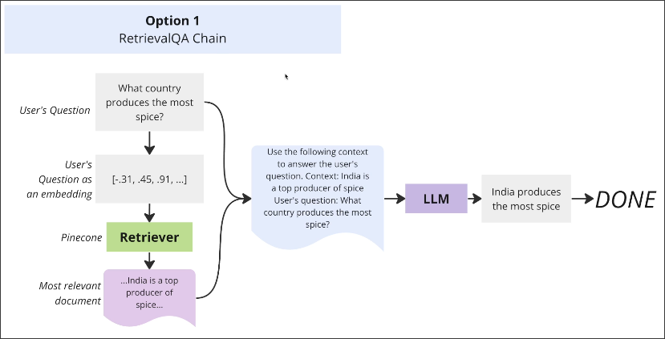
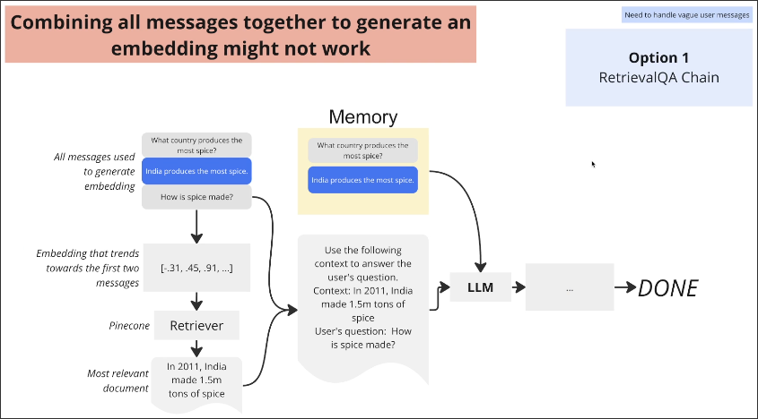
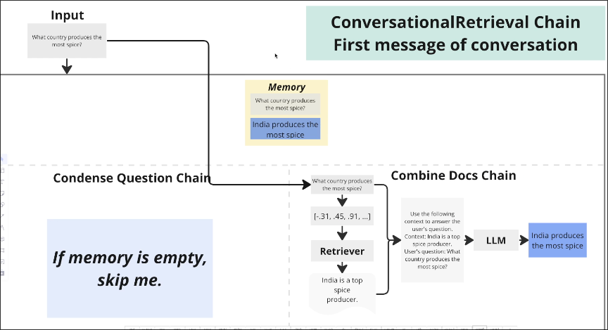
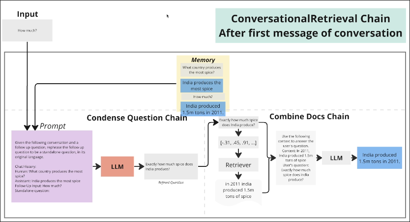

# Introducing the Conversational Retrieval Chain

In order to reach the final requirements of [[2025-02-08_Understanding-the-Apps-Requirements|Understanding the Apps Requirements]], there are two different chains we can choose from.

## Option 1: RetrievalQA Chain

However, the RetrievalQA Chain is not designed for conversation, but simply to find the most relevant documents based on the user's question through retrieval and answer the user's question.

However, Chain itself has high scalability, so we can still add memory to the RetrivevalQA Chain as follows.

However, even though memory has been added to the LLM structure above, the query "How much?" inputted in the retrieval is still too vague, causing the retriever to not find any relevant documents.

We will further improve this framework as follows:

In the above framework, we use a method to allow the retriever input to include all memory messages. However, for the retriever, it may search for documents about the country that produces the most spices instead of retrieving documents about the user's most recent input question.

## Option 2: Conversational Retrieval Chain

To solve the various problems encountered in Option 1, LangChain provides Conversational Retrieval Chain as a solution. Its principle is as follows:

Conversation Retrieval Chain is actually composed of two chains, namely Condense Question Chain and Combine Docs Chain.

The first chain is used to refine the question (Which is a regular RetrievalQA Chain lack of), the second chain is used to retrieve documents and then combine them with user input to form a prompt for LLM to answer (similar to a regular RetrievalQA Chain).

The key point is that the first LLM prompt will include all memory messages and the user's latest input, then refine a new question through the first LLM, and then use this refined question to retrieve documents.

