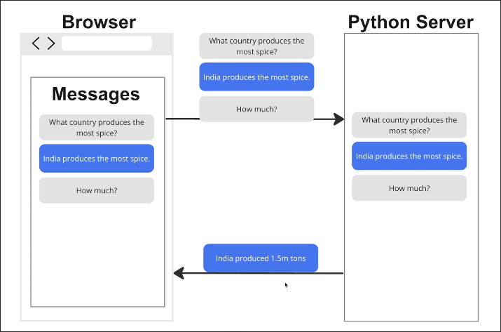
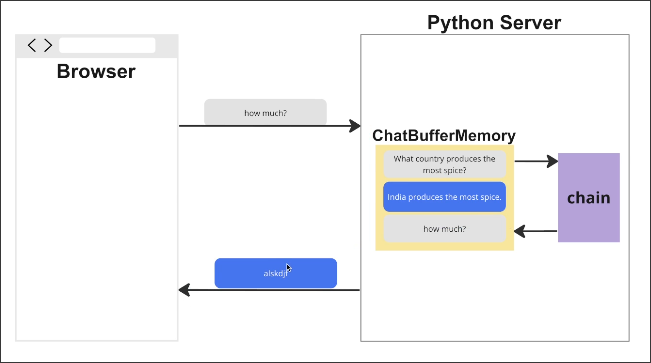
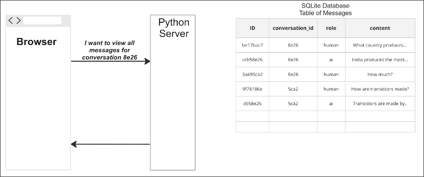
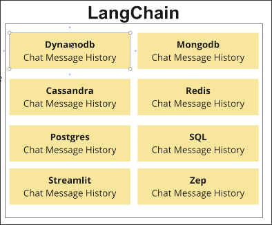

# Persistent Messages with the Database

There are three options for persisting messages...

## Option 1: Store messages on the client
Store messages on the client. Whenever user submits a question, send all the messages over.

Super eazy to implement. But, if the user refreshes the page, all the messages are gone.

## Option 2: Store messages on the server

We may create a memory object for each user on the server side to store messages as follows.

Depending on the type of memory object used, the web may not easily access messages until LangChain is used.

When the server restarts, all messages will disappear.

## Option 3: Store messages in the database

Store messages in the database. Whenever user submits a question or LLM replies, save the message to the database.

Easy to show a list of messages without involving any LangChain logic.

Messages will persist even if the server restarts.

## In fact, LangChain provides some classes to help you store messages in the database.

You can choose to use them, but the instructor recommends implementing them yourself instead of using these classes, because if you use these classes to store messages, a lot of details will be hidden from you. Therefore, integrating this data into other parts of the app may be difficult.

