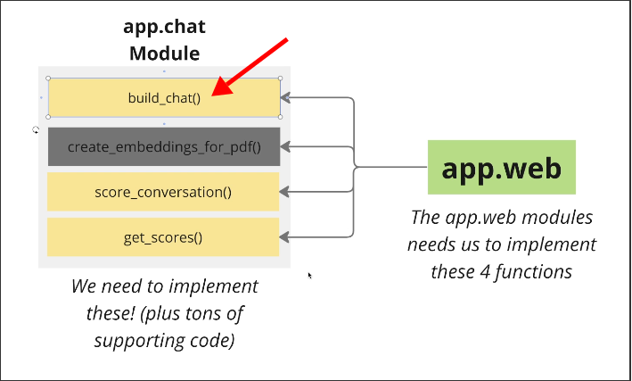
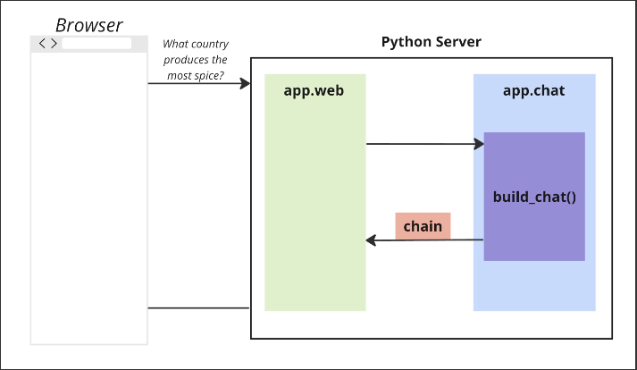

# Understanding the Apps Requirements

After completing `create_embeddings_for_pdf()`, the next exposed function of the module app.chat that we need to complete is `build_chat()`.


The file for the function has been created in the module app.chat, but it only contains some comments. We need to implement this function ourselves.

File: /home/matt/Projects/pdf/app/chat/chat.py

```python
from app.chat.models import ChatArgs


def build_chat(chat_args: ChatArgs):
    """
    :param chat_args: ChatArgs object containing
        conversation_id, pdf_id, metadata, and streaming flag.

    :return: A chain

    Example Usage:

        chain = build_chat(chat_args)
    """

    pass
```



## Requirements

We used [[2025-01-29_Building-a-Retrieval-Chain|Retrieval Chain]] to handle document retrieval before, but in order to meet the requirements of the app, the whole thing will become more complicated because we need to consider the following points:

**1. Document retrieval needs to be scoped to a particular PDF.**

**2. Need to organize and persist messages + conversations so they can used by both web + chat**
Not only for LLM messages, these historical messages also need to be available for web use before chat is used.

**3. Need to handle vague user messages**
Sometimes the user's questions can be very vague. Without context, the AI model will have a hard time answering. This problem cannot be solved just by adding memory; it also requires some other techniques.
