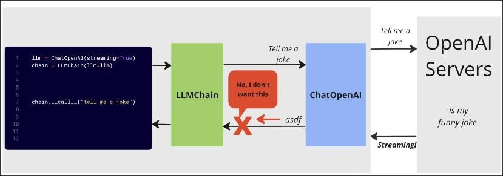

# Chains Dont Want to Stream

## Old LangChain

In the explanation of using Chain, although there is a method `stream`, it does not actually generate chunks, but generates all results at once. We need to override the `stream` method of Chain to make it truly generate chunks.

## LangGraph

Although the document states that LangGraph supports streaming, multiple tests have failed to actually implement streaming.
