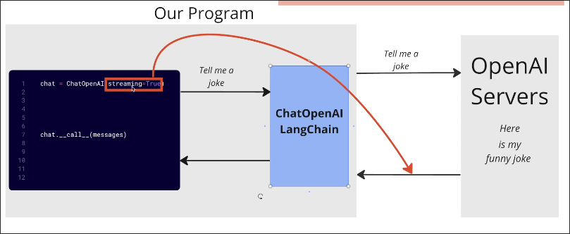
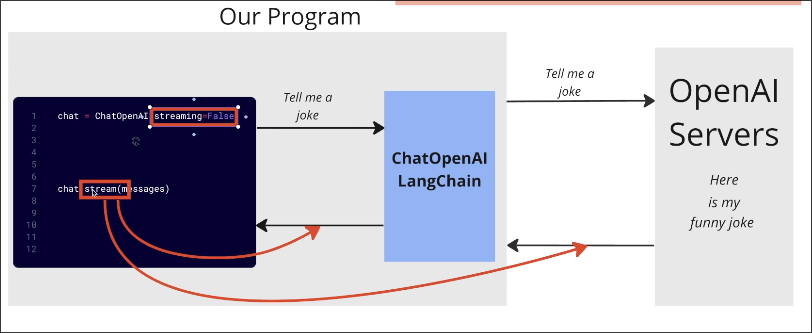

# Experimenting with a Streaming language Model

We slightly modified the codes from the [[2025-02-10_Creating-a-Working-Playground|previous topic]].

File: /home/matt/Projects/pdf/test.py
```python
from langchain_core.output_parsers import StrOutputParser
from langchain_core.prompts import ChatPromptTemplate
from langchain_openai import ChatOpenAI

chat = ChatOpenAI(
    model="gpt-4o-mini",
    streaming=True  # This is the only change
)

prompt = ChatPromptTemplate.from_messages([("human", "{question}")])

query = (
    prompt
    | chat
    | StrOutputParser()
)

response = query.invoke({"question": "What is the capital of France?"})
print(response)

```
`streaming=True` means that the model will generate text in chunks. Let's try to run the code to see the difference.

```sh
 python test.py
The capital of France is Paris. # still prints all at once
```

But the result is still the same even the model is set to streaming. That's because the segment from python server to the terminal is not streaming.



We need to modify the code to stream the output from python server to the terminal.

```py
from langchain_core.output_parsers import StrOutputParser
from langchain_core.prompts import ChatPromptTemplate
from langchain_openai import ChatOpenAI

chat = ChatOpenAI(
    model="gpt-4o-mini",
    streaming=True
)

prompt = ChatPromptTemplate.from_messages([("human", "{question}")])

query = (
    prompt
    | chat
    | StrOutputParser()
)

response = query.stream({"question": "tell me a joke?"})
#               ^^^^^^^ replace `invoke` with `stream`, then the return value is a generator(means it's iterable)

# because the response is a generator, we need to iterate over it to get the output
for message in response:
    print(message)
```

Let's run the code again.

```sh
 python test.py

Why
 don't
 scientists
 trust
 atoms
?


Because
 they
 make
 up
 everything
!

```

In fact, the method `stream` effect two segments, if `streaming=False`, it'll still force the model to generate text in chunks.




So, the `streaming=True` can be omitted if we use the `stream` method.


