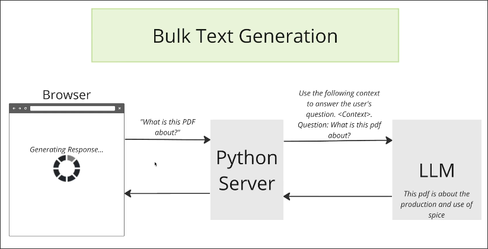
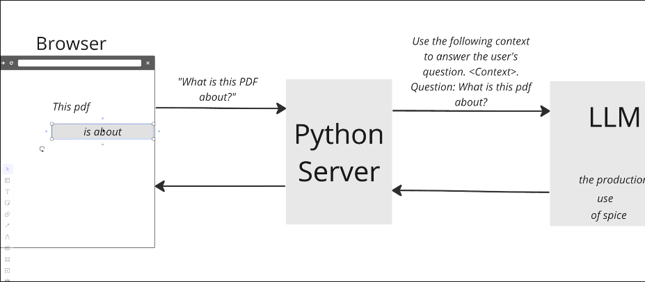

# Streaming Text Generation

We used to send prompts from the browser to the Python server, which then sent the prompts to LLM. The server would only return the complete LLM response to the browser when it was ready, as shown in the diagram below.

The above method is very poor for user experience, because users have to wait a long time for the spinner to see the results. In the meantime, users cannot confirm if the submission was successful or see the progress.

Therefore, we need to gradually generate text with LLM, and the Python server will gradually send the generated text back to the browser, as follows:

It is very simple to let LLM generate text gradually, but it is a challenge to let the Python server gradually receive text and gradually send text to the browser.

