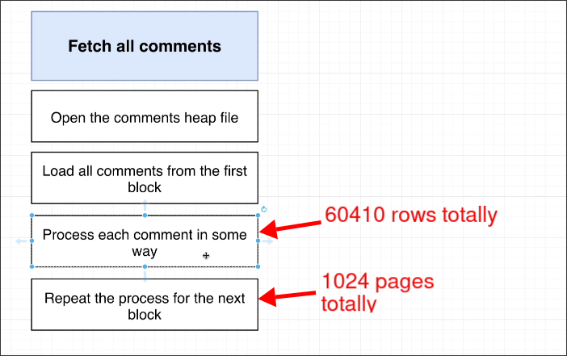

# Calculating Cost by Hand

In [[2025-02-12_Developing-an-Intuitive-Understanding-of-Cost|the previous topic]], we manually calculated costs of plans based on the number of pages loading up from the disk and the type of page read (random or sequential). In this topic, we add the cost of checking rows.

```sql
EXPLAIN SELECT username, contents
FROM users
JOIN comments ON comments.user_id = users.id
WHERE username = 'Alyson14';


---OUTPUT---
                                         QUERY PLAN                                          
---------------------------------------------------------------------------------------------
 Hash Join  (cost=8.31..1795.11 rows=11 width=81)
   Hash Cond: (comments.user_id = users.id)

   -- Let's only analyze the cost of this step
   ->  Seq Scan on comments  (cost=0.00..1628.10 rows=60410 width=72)

   ->  Hash  (cost=8.30..8.30 rows=1 width=17)
         ->  Index Scan using users_username_idx on users  (cost=0.28..8.30 rows=1 width=17)
               Index Cond: ((username)::text = 'Alyson14'::text)
(6 rows)
```

We can guess the actual steps of that line as shown in the following figure.


The diagram not only lists the actual steps of `Seq Scan on comments`, but also the number of pages and rows in this table.

Before, we only considered the cost of page loading, but in reality, we also need to take into account the cost of row checking even though it consumes far fewer resources than page loading.

We boldly assume that the cost of sequential loading page is 1, and the cost of checking row is 0.01, then we can calculate the cost with the following formula:

```py
1024 * 1.0 + 60410 * 0.01 = 1628.1
```

The cost of the `Seq Scan on comments` is 1628.1, which is the same as the planner's calculation.

Therefore, we can speculate that the planner uses a sequential page loading cost of 1 as the baseline value, and then obtains a random page loading cost of 4 and a row checking cost of 0.01 relatively.


