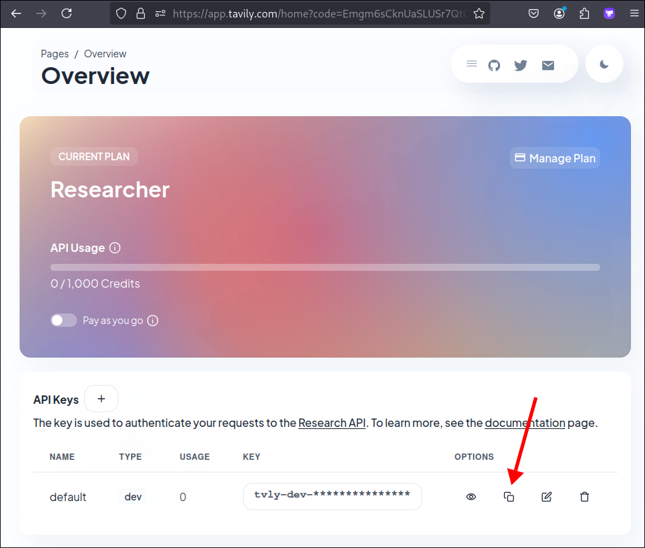

# Create the function of Tool

In [[2025-02-11_Create-react-agent-and-execut-it|Create react agent and execut it]], we still use placeholder "?" to the parameter `func`, we'll write the actual function for it this topic.

For search external resource, I'll use Travily API, Langchain community provides its wrapper class - TravilySearchResults, but still need to sign up on Travily website to get API key...



Then, store it to enviroment variable with name `TAVILY_API_KEY`, class TravilySearchResults will use it automatically.

Now, we can build the function to search online with class TravilySearchResults...

```sh
 tree
.
├── agents
│   ├── __init__.py
│   └── linkedin_lookup_agent.py
├── ice_breaker.py
├── LICENSE
├── Pipfile
├── Pipfile.lock
├── README.md
├── third_parties
│   ├── __init__.py
│   └── linkedin.py
└── tools # Create module tools
    ├── __init__.py
    └── tools.py # write the function of Tool here

```

File: /home/matt/Github/ice_breaker/tools/tools.py
```python
from langchain_community.tools.tavily_search import TavilySearchResults


def get_profile_url_tavily(name: str):
    """Searches for Linkedin or Twitter Profile Page."""
    search = TavilySearchResults()
    res = search.run(f"{name}")
    return res

# test purpose
if __name__ == "__main__":
    print(get_profile_url_tavily("John Doe"))
```

Let's test the function in the terminal:

```sh
$ python tools/tools.py
[
  {
    url: "https://en.wikipedia.org/wiki/John_Doe",
    content:
      "John Doe (male) a nd Jane Doe (female) are multiple-use placeholder names that are used in the Bri tish and American legal system and aside generally in the United Kingdom and the United States when the true name of a person is unknown or is being intentional ly concealed.[1][2][3] In the context of law enforcement in the United States, s uch names are often used to refer to a corpse whose identity is unknown or canno t be confirmed.",
  },
  {
    url: "https://en.wikipedia.org/wiki/John_Doe_(musician)",
    content:
      'John Doe In addition to X, Doe performs with the country-folk-punk b and the Knitters and has released records as a solo artist. Other movie acting c redits include Road House, Vanishing Point, Salvador, Boogie Nights, The Special s, The Good Girl, Gypsy 83, Wyatt Earp, Border Radio, The Outsiders, and Brokedo wn Palace. John Doe albums 1990    Meet John Doe   193 —   —   —   Geffen "John Doe: The \'X\' Man Returns" (audio). "John Doe on his first big movie, solo reco rd, and day as a dad". "In Conversation With X\'s John Doe". "John Doe of X". "J ohn Doe Moves to Austin". "John Doe and Exene Cervenka of X to Release Duets Alb um". John Doe John Doe at AllMusic John Doe discography at MusicBrainz',
  },
  {
    url: "https://www.imdb.com/name/nm0230335/",
    content:
      "John Doe - IMDb John Doe(I) 14 Videos12 Photos John Doe was born on 25 February 1953 in Decatur, Illinois, USA. He is an actor and composer, known for Road House (1989), The Bodyguard (1 992) and Pure Country (1992). View contact info at IMDbPro John Doe (voice) John Doe John Doe John Doe TV Movie X: Burning House of Love Was in \"L.A. Woman,\" a music video directed by Ray Manzarek (organist of the 1960s rock group The Doors and producer of Doe's punk rock group X) in 1985. You should respect the work you're gonna do and get there. How old is John Doe? *   When was John Doe born? *   Where was John Doe born? Edit page",
  },
  {
    url: "http://www.theejohndoe.com/",
    content:
      "Official website for musician, actor & writer John Doe of the Los Angeles band X.",
  },
  {
    url: "https://www.fbi.gov/wanted/ecap/unknown-individual-- -john-doe-40",
    content:
      "John Doe 40 is described as a White male, likely betw een the ages of 30 and 40 years old. He appears to be heavyset with dark colored hair. John Doe 40 has a",
  },
];

```

Then, we replace the "?" in the agent file with the function `get_profile_url_tavily`:

File: /home/matt/Github/ice_breaker/agents/linkedin_lookup_agent.py
```python
from langchain_openai import ChatOpenAI
from langchain_core.prompts import PromptTemplate
from langchain_core.tools import Tool
from langchain.agents import (
    create_react_agent,
    AgentExecutor,
)
from langchain import hub
from tools.tools import get_profile_url_tavily # import the tool's function

def lookup(name: str) -> str:
    llm = ChatOpenAI(
        temperature=0,
        model="gpt-4o-mini"
    )
    template = """given the full name {name_of_person} I want you to get it me a link to their linkedin profile page.
                        You answer should contain only a URL"""

    prompt_template = PromptTemplate(
        template=template, input_variables=["name_of_person"]
    )
    tools_for_agent = [
        Tool(
            name="Crawl Google 4 linkedin profile page",
            func=get_profile_url_tavily, # replace "?" with the actual function
            description="useful for wen you need get the linkedin Page URL",
        )
    ]
    react_prompt = hub.pull("hwchase17/react")
    agent = create_react_agent(llm=llm, tools=tools_for_agent, prompt=react_prompt)
    agent_executor = AgentExecutor(agent=agent, tools=tools_for_agent, verbose=True)
    
    result = agent_executor.invoke(
        input={"input": prompt_template.format_prompt(name_of_person=name)}
    )

    linked_profile_url = result["output"]
    return linked_profile_url


# Test purpose
if __name__ == "__main__":
    linkedin_url = lookup(name="Eden Marco")
    print(linkedin_url)

```


Let's test the agent in the terminal:

```sh
 python -m agents.linkedin_lookup_agent

/home/matt/.local/share/virtualenvs/ice_breaker-gEYUNqx7/lib/python3.13/site-packages/langsmith/client.py:253: LangSmithMissingAPIKeyWarning: API key must
 be provided when using hosted LangSmith API
  warnings.warn(


> Entering new AgentExecutor chain...

I need to find the LinkedIn profile page for someone named Eden Marco. To do this, I will use the tool to search for their LinkedIn profile.  

Action: Crawl Google 4 linkedin profile page  # tool name, means the tool is working
Action Input: Eden Marco # input is `Eden Marco` to tool

# response of the tool
[
  {
    url: "https://www.linkedin.com/in/edenmarco",
    content:
      "Eden Marco\nStrategy Analyst at Deloitte\nNew York, United States\ n1032 connections, 1036 followers\n\n\nAbout:\nN/A\n\n\nExperience:\nStrategy Analyst at Deloitte Digital (https://www.linkedin.com/company/deloitte-digit al)\nAug 2023 - Present\nNew York, New York, United States\n\n\nEducation:\nUNC Kenan-Flagler Business School\nBSBA, Business Administration\nN/A - Presen t\nGrade: N/A\nActivities and societies: N/A",
  },
  {
    url: "https://www.linkedin.com/in/eden-marco",
    content:
      "Eden Marco\nLLMs @ Google Cloud | Best-selli ng Udemy Instructor | Backend & GenAI | Opinions stated here are my own, not those of my company\nUnited States, United States of America\n4995 connection s, 6872 followers\n\n\nAbout:\nBackend developer --> Now an AI Engineer, Udemy.com best seller instructor\nOpinions stated here are my own, not those of m y company\n\n\nExperience:\nLLM Specialist, Customer Engineering - Google Cloud at Google (https://www.linkedin.com/company/google)\nJul 2023 - Present\n\ n\nEducation:\nTechnion - Israel Institute of Technology\nBachelor’s Degree, Computer Science\nJan 2015 - Dec 2019\nGrade: N/A\nActivities and societies: N/A",
  },
  {
    url: "https://odsc.com/blog/speaker/eden-marco/",
    content:
      "Eden Marco | Open Data Science Conference Ai+ AI Agents East 2025 Training Track A I Agents East 2025 Training Track With years of experience in backend development, he currently works at Google as an LLM Specialist, assisting customers in implementing complex generative AI solutions on GCP using open-source frameworks like LangChain and Google's generative AI services. This two-hour sess ion is crafted for AI practitioners who already possess a background in Python and familiarity with LangChain, aiming to elevate their skills in developin g cutting-edge LLM agentic applications. By the end of this workshop, participants will be equipped with the expertise to leverage LangGraph by LangChain for developing sophisticated LLM agents, ready to tackle a diverse range of applications in production environments.",
  },
  {
    url: "https://www.researchgate. net/profile/Eden-Marco",
    content:
      "Eden MARCO | University of Toronto, Toronto | U of T | Department of Medicine | Research profile Join ResearchGate to contact this researcher and connect with your scientific community. Join ResearchGate to contact this researcher and connect with your scientific communi ty. Research Research Join ResearchGate to find the people and research you need to help your work Only verified researchers can join ResearchGate and sen d messages to other members. University students and faculty, institute members, and independent researchers Not a researcher Sorry, you need to be a rese archer to join ResearchGate. Recruit researchers Tip: Most researchers use their institutional email address as their ResearchGate login Tip: Most researc hers use their institutional email address as their ResearchGate login",
  },
  {
    url: "https://www.udemy.com/user/eden-marco/?srsltid=AfmBOor_QZrqk8Yu5RoASbVX _2VHya4Fj3hP5DnVt44WKvKLqLSzieNP",
    content:
      "I am a passionate Software Engineer with years of experience in back-end development, one of the first engi neers at Orca Security, and now I am working as a",
  },
];

# there are two linkedin urls in the response, agent will thinking which one is the best answer...

I have found multiple LinkedIn profiles for individuals named Eden Marco. I need to determine which on
e is the most relevant based on their current roles and locations.

1. **Profile 1**: [Eden Marco - Strategy Analyst at Deloitte](https://www.linkedin.com/in/edenmarco) - New York, United States.
2. **Profile 2**: [Eden Marco - LLM Specialist at Google Cloud](https://www.linkedin.com/in/eden-marco) - United States.

Both profiles are valid, but the second one seems to be more prominent due to the association with Google Cloud and a larger number of connections.

Thought: I will choose the second profile as it appears to be more relevant and has a significant professional background.

Final Answer: https://www.linkedin.com/in/eden-marco

> Finished chain.
https://www.linkedin.com/in/eden-marco # final answer, only URL, no any flutters :D

                                       # if you use old model like `gpt-3-5-turbo`, you may get the url with flutters,
                                       # but that's fine, because this answer will be took by LLM, so it's robust

```

