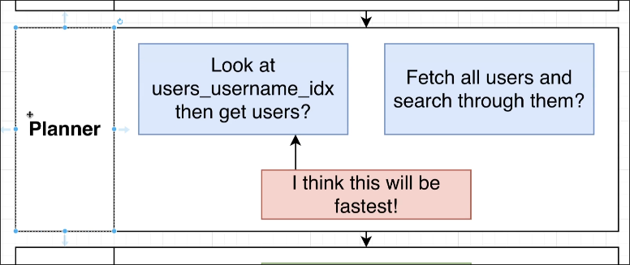
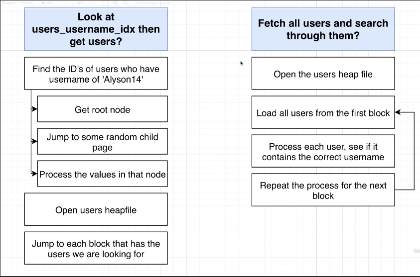
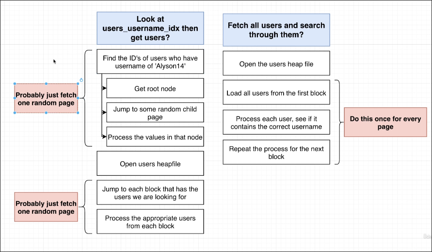
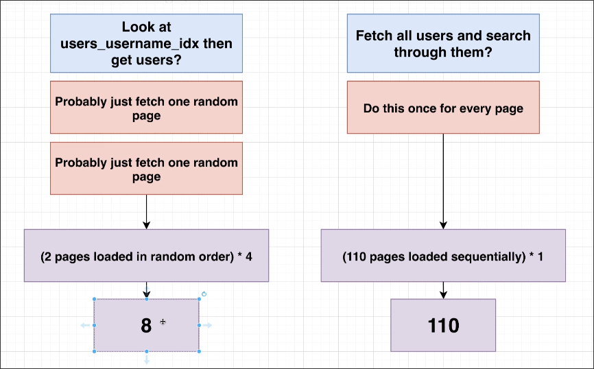

# Developing an Intuitive Understanding of Cost

In [[2025-02-12_Explain-and-Expain-Analyze|Explain and Expain Analyze]], we saw each query step has the cost associated with it.

```sql
EXPLAIN SELECT username, contents
FROM users
JOIN comments ON comments.user_id = users.id
WHERE username = 'Alyson14';

--- OUTPUT ---
                                         QUERY PLAN                                          
---------------------------------------------------------------------------------------------
 Hash Join  (cost=8.31..1795.11 rows=11 width=81)
 --          ^^^^^^^^^^^^^^^^^^
   Hash Cond: (comments.user_id = users.id)
   ->  Seq Scan on comments  (cost=0.00..1628.10 rows=60410 width=72)
   --                         ^^^^^^^^^^^^^^^^^^
   ->  Hash  (cost=8.30..8.30 rows=1 width=17)
   --         ^^^^^^^^^^^^^^^
         ->  Index Scan using users_username_idx on users  (cost=0.28..8.30 rows=1 width=17)
         --                                                 ^^^^^^^^^^^^^^^
               Index Cond: ((username)::text = 'Alyson14'::text)
(6 rows)
```

The working definition for 'cost' is **amount of time to execute some part of our query plan**. (Not super accurate, but it's a good enough for now.)

```sql
SELECT *
FROM users
WHERE username = 'Alyson14';
```

For above query, let's try to understand how the planner calculates the cost.


Assuming the Planner analyzes the above query and comes up with two query plans, one using an index and the other directly scanning the entire table without using an index.

Based on our current knowledge of index and heap file, we can speculate that the actual query plan is as follows:


The most resource-intensive part is reading pages (blocks) from the hard drive to memory, so we just need to calculate how many pages each plan reads into memory in each part.




You can see that the query plan on the left only needs to read two random pages into memory using an index, while the plan on the right needs to read all pages of the heap file into memory. However, because the pages on the left are random, the reading time will be longer. The pages on the right are sequential, so the reading time will be faster. We make a bold assumption that reading randomly distributed pages is 4 times slower than reading sequentially distributed pages, so we can derive the following calculation formula.


We assume that the heap file of the table has 110 pages, so we can calculate the cost as follows:



Therefore, the planner will choose the query plan on the left when seeing the above results.

The above is a simple simulation for Planner to calculate costs and make decisions. Although it is not very accurate and has many assumptions, this simulation can help us intuitively understand the concept of cost.


