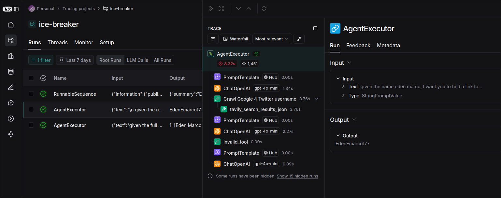

# Tracing application with LangSmith

LangSmith is a tool that allows you to trace the execution of a LangChain application. It provides a visual representation of the execution flow, which can be useful for debugging and understanding how your application works.

For using LangSmith, you need to sign up for an account on the LangSmith website and get an API key, then set up some environment variables in your .env file.

File: /home/matt/Github/ice_breaker/.env
```sh
LANGSMITH_TRACING=true
LANGSMITH_ENDPOINT="https://api.smith.langchain.com"
LANGSMITH_API_KEY="lsv2_pt_..."
LANGSMITH_PROJECT="ice-breaker"
```

Then, use library `dotenv` to load the environment variables in your application.

File: /home/matt/Github/ice_breaker/app.py
```python
from dotenv import load_dotenv # import
from flask import Flask, render_template, request, jsonify
from ice_breaker import ice_break_with

load_dotenv() # load .env file to environment variables

app = Flask(__name__)

@app.route('/')
def index():
    return render_template('index.html')

@app.route('/process', methods=['POST'])
def process():
    name = request.form["name"]
    summary, profile_pic_url = ice_break_with(name=name)
    result = jsonify({
        "summary_and_facts": summary.to_dict(),
        "picture_url": profile_pic_url
    })
    print('result', result)
    return result


if __name__ == '__main__':
    app.run(debug=True)


```

And that's all, next time you run your application, you will see the tracing information on the LangSmith website.




You see, any details about the execution of LLM, tools, and even templates are displayed in the trace. It's a powerful tool for debugging and understanding how your application works.


