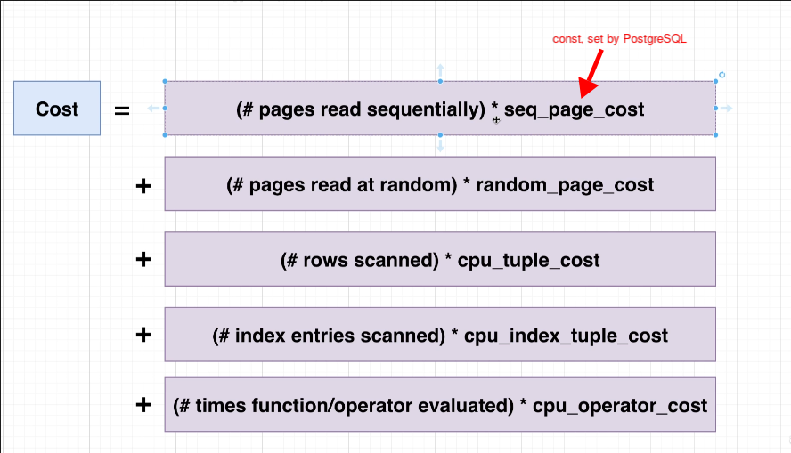
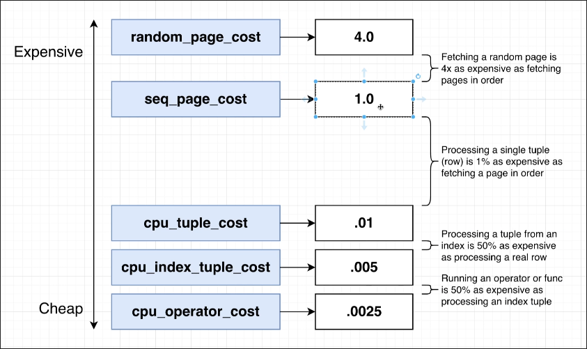

# A Touch More on Costs

Below is an approximate calculation method for Cost (not complete):



PostgreSQL gives each constant an appropriate value, and its definition and reasoning can be found in the link below.

[Cost Constants Documentation](https://www.postgresql.org/docs/current/runtime-config-query.html)

PostgreSQL sets the cost of seq_page_cost to 1.0, and the costs of other operations are relative to seq_page_cost. We can also change these values, but PostgreSQL's default settings are generally reasonable.


```sql
EXPLAIN SELECT username, contents
FROM users
JOIN comments ON comments.user_id = users.id
WHERE username = 'Alysia17';

--- OUTPUT ---
                                         QUERY PLAN                                          
---------------------------------------------------------------------------------------------
 Hash Join  (cost=8.31..1795.11 rows=11 width=81)
   Hash Cond: (comments.user_id = users.id)
   ->  Seq Scan on comments  (cost=0.00..1628.10 rows=60410 width=72)
   ->  Hash  (cost=8.30..8.30 rows=1 width=17)
         ->  Index Scan using users_username_idx on users  (cost=0.28..8.30 rows=1 width=17)
               Index Cond: ((username)::text = 'Alysia17'::text)
(6 rows)

```

So far, although we still need some more in-depth knowledge to fully calculate the cost of the query plan as shown in the example above, we can roughly understand how PostgreSQL calculates the cost.


