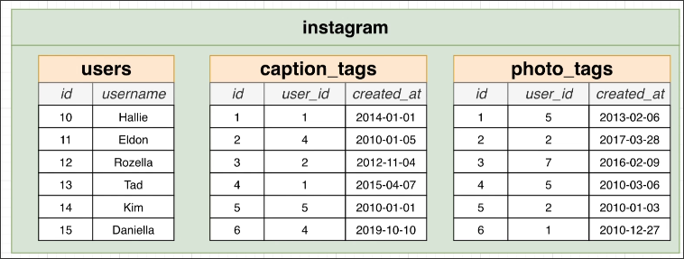
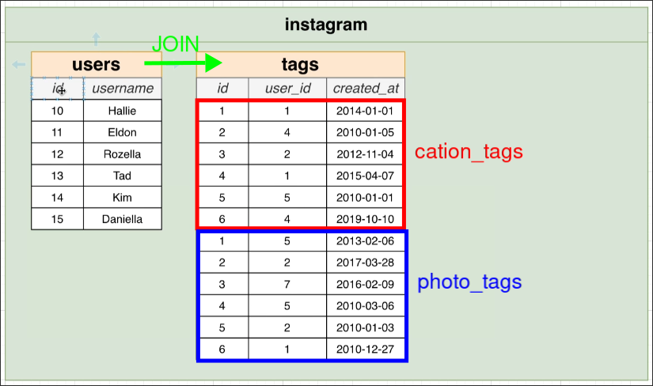

# Common Table Expressions

**Question:**
Show the username of users who were tagged in a caption or photo before January 7th, 2010. Also show the date they were tagged.

**Analysis:**
1. We can `UNION` the `caption_tags` and `photo_tags` tables to get all the tags as a new table `tags`.
2. Then, join the `tags` table with the `users` table.
3. Finally, filter the results to show only the tags before January 7th, 2010.

