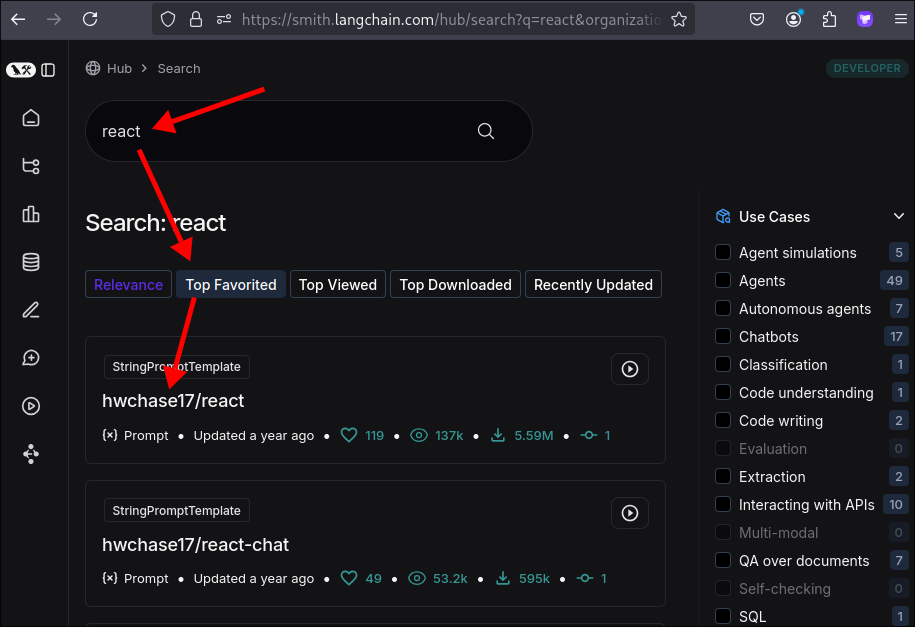
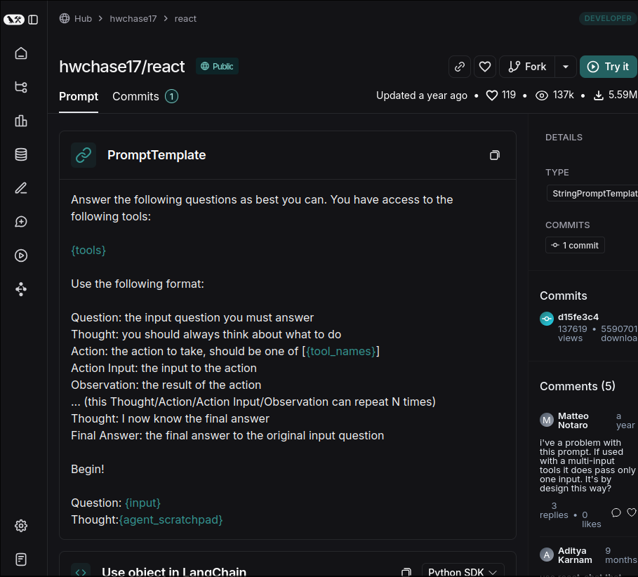

# Defining Tools for our ReAct agent

We want to convert regular function `get_text_length` to a tool which LLM can use. We will use the `@tool` decorator to define this tool instead of using class `Tool` directly.

File: /home/matt/Projects/react-langchain/main.py
```python
from dotenv import load_dotenv
from langchain.agents import tool # Import the tool decorator
load_dotenv()


@ tool # this decorator will convert the function to a StructuredTool object
def get_text_length(text: str) -> int:
#   ^^^^^^^^^^^^^^^ function name will be used as the tool name
    """Returns the length of the text by characters""" # this description will populate the tool's description
    return len(text)                                   # so it's important to have a good description


if __name__ == "__main__":
    print("Hello ReAct LangChain!")
    print(get_text_length.invoke(input={"text": "Hello ReAct LangChain!"}))
    #                    ^^^^^^^^^^^^^^^^^^^^^^ because get_text_length is a tool now, we cannot call it directly
    #                                           we need to use the invoke method to call the tool
    #                                           and pass the input as a dictionary
    #                                           it's for making the same interface for LangChain Expressions
```


The tool input generated by LLM often contains special characters such as \n and ", in order for `get_text_length` to correctly calculate the number of characters, we need to remove these special characters.

```py
from dotenv import load_dotenv
from langchain.agents import tool
load_dotenv()


@ tool
def get_text_length(text: str) -> int:
    """Returns the length of the text by characters"""
    return len(text.strip("'\n").strip('"'))
    #              ^^^^^^^^^^^^^^^^^^^^^^^^^^ remove special characters generated by LLM


if __name__ == "__main__":
    print("Hello ReAct LangChain!")
    print(get_text_length.invoke(input={"text": "Hello ReAct LangChain!"}))

```

Then we went to LangSmith's hub website to search for the prompt written by hwchase17 for ReAct Agent.





Copy the content of the prompt and paste it into main.py.

```py
from dotenv import load_dotenv
from langchain.agents import tool
load_dotenv()


@ tool
def get_text_length(text: str) -> int:
    """Returns the length of the text by characters"""
    return len(text.strip("'\n").strip('"'))


if __name__ == "__main__":
    print("Hello ReAct LangChain!")

    # This prompt is core to the ReAct Agent, it'll turn a regular LLM into a ReAct Agent
    template = """
    Answer the following questions as best you can. You have access to the following tools:

    {tools}

    Use the following format:

    Question: the input question you must answer
    Thought: you should always think about what to do
    Action: the action to take, should be one of [{tool_names}]
    Action Input: the input to the action
    Observation: the result of the action
    ... (this Thought/Action/Action Input/Observation can repeat N times)
    Thought: I now know the final answer
    Final Answer: the final answer to the original input question

    Begin!

    Question: {input}
    Thought:{agent_scratchpad}
    """
```

Then, we use the class PromptTemplate to fill in the placeholders in the above prompt to make it a complete prompt that can be given to LLM.

```py
from dotenv import load_dotenv
from langchain.agents import tool
from langchain.prompts import PromptTemplate
from langchain_core.tools import render_text_description
load_dotenv()


@ tool
def get_text_length(text: str) -> int:
    """Returns the length of the text by characters"""
    return len(text.strip("'\n").strip('"'))


if __name__ == "__main__":
    print("Hello ReAct LangChain!")

    template = """
    Answer the following questions as best you can. You have access to the following tools:

    {tools}

    Use the following format:

    Question: the input question you must answer
    Thought: you should always think about what to do
    Action: the action to take, should be one of [{tool_names}]
    Action Input: the input to the action
    Observation: the result of the action
    ... (this Thought/Action/Action Input/Observation can repeat N times)
    Thought: I now know the final answer
    Final Answer: the final answer to the original input question

    Begin!

    Question: {input}
    Thought:{agent_scratchpad}
    """

    # it may be multiple tools
    tools = [get_text_length]

    # fill in the placeholders in the prompt
    prompt = PromptTemplate.from_template(template=template).partial( # partial method will take all placeholders in the template as arguments
        tools=render_text_description(tools),
        #     ^^^^^^^^^^^^^^^^^^^^^^^^^^^^^^ because tools is a list of tools, we need to convert it to a string to replace placeholder {tools}
        tool_names=", ".join([t.name for t in tools]), # generate a string of tool names separated by comma to replace placeholder {tool_names}
    )

```

Finally, we create a llm object with OpenAI model:

```py
from dotenv import load_dotenv
from langchain.agents import tool
from langchain.prompts import PromptTemplate
from langchain_core.tools import render_text_description
from langchain_openai import ChatOpenAI
load_dotenv()


@ tool
def get_text_length(text: str) -> int:
    """Returns the length of the text by characters"""
    return len(text.strip("'\n").strip('"'))


if __name__ == "__main__":
    print("Hello ReAct LangChain!")

    template = """
    Answer the following questions as best you can. You have access to the following tools:

    {tools}

    Use the following format:

    Question: the input question you must answer
    Thought: you should always think about what to do
    Action: the action to take, should be one of [{tool_names}]
    Action Input: the input to the action
    Observation: the result of the action
    #            ^^^^^^^^^^^^^^^^^^^^^^^^ should be the output of the tool <----------------------------------
    ... (this Thought/Action/Action Input/Observation can repeat N times)
    Thought: I now know the final answer
    Final Answer: the final answer to the original input question

    Begin!

    Question: {input}
    Thought:{agent_scratchpad}
    """

    tools = [get_text_length]

    prompt = PromptTemplate.from_template(template=template).partial(
        tools=render_text_description(tools),
        tool_names=", ".join([t.name for t in tools]),
    )

    # Create a llm object with OpenAI model
    llm = ChatOpenAI(temperature=0)
    llm = llm.bind(stop=["\nObservation"])
    #              ^^^^^^^^^^^^^^^^^^^^^^ means stop the generation when the output contains "\nObservation"
    #                                     because we want to get the output of the tool only, not from LLM

```


