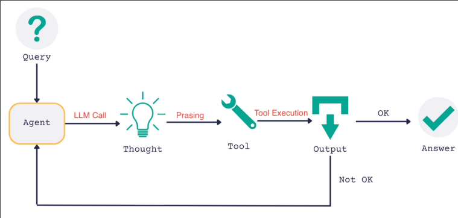

# Environment Setup + ReAct Algorithm overview

## What is AgentExecutor?

In our previous ice breaker project, we used AgentExecutor to provide runtime execution of agents, but it is actually just a while loop.

```py
# Fake AgentExecutor implementation
class FakeAgentExecutor:
    def invoke(self, input):
        while True:
            result = self.agent(input)
            if result == 'RunTool':
                tool_to_run(tool_input)
            else:
                return result
```

The above is a simple implementation example. This while loop will continuously execute the agent and decide whether to execute the tool or return the final answer based on the result of the agent. (Note that the implementation of the above code is not complete, this is just to illustrate the concept of AgentExecutor)

We can use a diagram to describe the operation of AgentExecutor.


We will implement all the processes ourselves in the upcoming topics.


## Create new environment for new project

```sh
 mkdir react-langchain
 cd react-langchain/
 pipenv shell
 pipenv install langchain langchain-openai black python-dotenv
```

Create a .env file in the project root directory and add some environment variables.

File: /home/matt/Projects/react-langchain/.env
```sh
LANGSMITH_TRACING=true
LANGSMITH_ENDPOINT="https://api.smith.langchain.com"
LANGSMITH_API_KEY="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"
LANGSMITH_PROJECT="ice-breaker"
```

Create a main.py file in the project root directory and add the following code for simple testing.


File: /home/matt/Projects/react-langchain/main.py
```python
from dotenv import load_dotenv
load_dotenv()


def get_text_length(text: str) -> int:
    """Returns the length of the text by characters"""
    return len(text)


if __name__ == "__main__":
    print("Hello ReAct LangChain!")
    print(get_text_length("Hello ReAct LangChain!"))
```

Run the main.py file to test the environment setup.

```sh
 python main.py
Hello ReAct LangChain!
22
```


