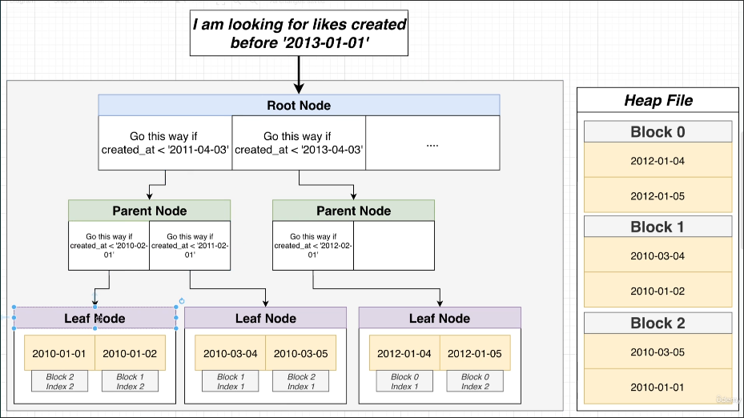

# Use My Index!

```sql
EXPLAIN SELECT *
FROM likes
WHERE created_at < '2013-01-01';

---OUTPUT---
                                 QUERY PLAN                                  
-----------------------------------------------------------------------------
 Seq Scan on likes  (cost=0.00..14248.11 rows=63025 width=24)
   Filter: (created_at < '2013-01-01 00:00:00+00'::timestamp with time zone)
(2 rows)
```

Planner decides to use a sequential scan for the above query because there is no index available. We will create an index to speed up this query.

```sql
CREATE INDEX ON likes (created_at);

---OUTPUT---
CREATE INDEX
```
Because there are a lot of rows in the likes, PostgreSQL will automatically divide the root node into more segments, and add an extra layer of parent node between the root node and the leaf node to help with segmentation, so that the desired data can be quickly found.




Run the query again and see.

```sql
EXPLAIN SELECT *
FROM likes
WHERE created_at < '2013-01-01';

---OUTPUT---
                                        QUERY PLAN                                        
------------------------------------------------------------------------------------------
 Bitmap Heap Scan on likes  (cost=1184.87..6820.68 rows=63025 width=24)
   Recheck Cond: (created_at < '2013-01-01 00:00:00+00'::timestamp with time zone)
   ->  Bitmap Index Scan on likes_created_at_idx  (cost=0.00..1169.11 rows=63025 width=0)
         Index Cond: (created_at < '2013-01-01 00:00:00+00'::timestamp with time zone)
(4 rows)
```

This time, the planner chose to use an index.

What will happen if we change "<" to ">"?

```sql
EXPLAIN SELECT *
FROM likes
WHERE created_at > '2013-01-01';
--               ^ replace "<" with ">"

---OUTPUT---
                                 QUERY PLAN                                  
-----------------------------------------------------------------------------
 Seq Scan on likes  (cost=0.00..14248.11 rows=688983 width=24)
   Filter: (created_at > '2013-01-01 00:00:00+00'::timestamp with time zone)
(2 rows)
```

You will find that the Planner chose to use a full table scan because if an index is used, it would require moving most of the pages, causing an excessive number of **random loading pages**, which would actually be slower than a full table scan.

Therefore, indexes are suitable for searching a **smaller portion** of data in a table, rather than a large portion of data.

It is recommended to use `EXPLAIN` to check if the Planner is actually using an index for each query. If it often does not use an index, consider dropping the index to avoid wasting resources.


