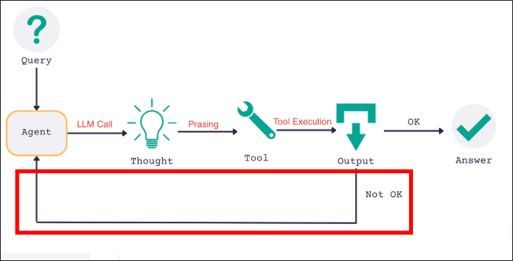
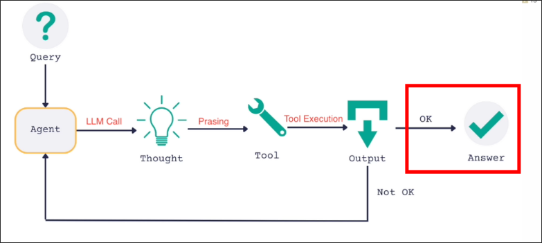

# AgentAction, AgentFinish, ReAct Loop

In [[2025-02-15_ReAct-prompt,-LLM-Reasoning-Engine,-Output-Parsing-and-Tool-Execution|the previous topic]], we executed the tool that llm chose for us. Now, we'll loop back to llm again with the tool execution history.



```py
from dotenv import load_dotenv
from langchain.agents import tool
from langchain.prompts import PromptTemplate
from langchain_core.tools import render_text_description
from langchain_openai import ChatOpenAI
from langchain.agents.output_parsers import ReActSingleInputOutputParser
from langchain.schema import AgentAction, AgentFinish
from typing import List, Union
from langchain.tools import BaseTool
load_dotenv()


@ tool
def get_text_length(text: str) -> int: ...

def find_tool_by_name(tools: List[BaseTool], tool_name: str) -> BaseTool: ...

if __name__ == "__main__":
    print("Hello ReAct LangChain!")

    template = """
    Answer the following questions as best you can. You have access to the following tools:

    {tools}

    Use the following format:

    Question: the input question you must answer
    Thought: you should always think about what to do
    Action: the action to take, should be one of [{tool_names}]
    Action Input: the input to the action
    Observation: the result of the action
    ... (this Thought/Action/Action Input/Observation can repeat N times)
    Thought: I now know the final answer
    Final Answer: the final answer to the original input question

    Begin!

    Question: {input}
    Thought: {agent_scratch}  <-------------------------------- We add agent_scratch back!!! Because it's responsible for storing the tool execution history
    """

    tools = [get_text_length]

    prompt = PromptTemplate.from_template(template=template).partial(
        tools=render_text_description(tools),
        tool_names=", ".join([t.name for t in tools]),
    )

    llm = ChatOpenAI(temperature=0, model="gpt-4o-mini")
    llm = llm.bind(stop=["\nObservation"])

    agent = (
        {
            "input": lambda x: x['input'],
            "agent_scratch": lambda x: x['agent_scratch'], # because there is one more parameter `agent_scratch` in the prompt
        }
        | prompt
        | llm
        | ReActSingleInputOutputParser()
    )

    intermediate_steps = []  # create a list variable to store the tool execution history

    agent_step: Union[AgentAction, AgentFinish] = agent.invoke({
        "input": "What is the length of the text 'DOG'?",
        "agent_scratch": intermediate_steps # because there is one more parameter `agent_scratch` at the first of the agent pipeline
    })

    if isinstance(agent_step, AgentAction):
        tool_name = agent_step.tool
        tool_to_use = find_tool_by_name(tools, tool_name)
        tool_input = agent_step.tool_input

        observation = tool_to_use.invoke({"text": tool_input})

        intermediate_steps.append((agent_step, str(observation))) # whenever a tool is executed, store the tool execution history to the list `intermediate_steps`
        #                         ^^^^^^^^^^^^^^^^^^^^^^^^^^^^^^
        #                         This should be a Tuple of (AgentAction, str) such as
        # (AgentAction(tool='get_text_length', tool_input='DOG', log="Thought: I need to find the length of the text 'DOG' in characters. \nAction: get_text_length \nAction Input: 'DOG' "), '3')

```

Currently, the parameter `agent_scratch` in the template is directly passed into intermediate_steps, but the final prompt should be a string. Therefore, we need to convert intermediate_steps into a string before passing it into the template. Fortunately, LangCain has provided us with a tool to convert List[(AgentAction, str)] into a string.

```py
from dotenv import load_dotenv
from langchain.agents import tool
from langchain.prompts import PromptTemplate
from langchain_core.tools import render_text_description
from langchain_openai import ChatOpenAI
from langchain.agents.output_parsers import ReActSingleInputOutputParser
from langchain.agents.format_scratchpad import format_log_to_str # import the tool to convert List[(AgentAction, str)] into a string
from langchain.schema import AgentAction, AgentFinish
from typing import List, Union
from langchain.tools import BaseTool
load_dotenv()


@ tool
def get_text_length(text: str) -> int:...

def find_tool_by_name(tools: List[BaseTool], tool_name: str) -> BaseTool:...

if __name__ == "__main__":
    print("Hello ReAct LangChain!")

    template = """..."""

    tools = [get_text_length]

    prompt = PromptTemplate.from_template(template=template).partial(
        tools=render_text_description(tools),
        tool_names=", ".join([t.name for t in tools]),
    )

    llm = ChatOpenAI(temperature=0, model="gpt-4o-mini")
    llm = llm.bind(stop=["\nObservation"])

    agent = (
        {
            "input": lambda x: x['input'],
            "agent_scratch": lambda x: format_log_to_str(x['agent_scratch']),
            #                          ^^^^^^^^^^^^^^^^^ convert List[(AgentAction, str)] into a string, then pass it into the template
        }
        | prompt
        | llm
        | ReActSingleInputOutputParser()
    )

    intermediate_steps = []

    agent_step: Union[AgentAction, AgentFinish] = agent.invoke({
        "input": "What is the length of the text 'DOG'?",
        "agent_scratch": intermediate_steps
    })

    if isinstance(agent_step, AgentAction):
        tool_name = agent_step.tool
        tool_to_use = find_tool_by_name(tools, tool_name)
        tool_input = agent_step.tool_input

        observation = tool_to_use.invoke({"text": tool_input})

        intermediate_steps.append((agent_step, str(observation)))

```

Then, we invoke the chain again with tool execution history.

```py
from dotenv import load_dotenv
from langchain.agents import tool
from langchain.prompts import PromptTemplate
from langchain_core.tools import render_text_description
from langchain_openai import ChatOpenAI
from langchain.agents.output_parsers import ReActSingleInputOutputParser
from langchain.agents.format_scratchpad import format_log_to_str
from langchain.schema import AgentAction, AgentFinish
from typing import List, Union
from langchain.tools import BaseTool
load_dotenv()


@ tool
def get_text_length(text: str) -> int:...

def find_tool_by_name(tools: List[BaseTool], tool_name: str) -> BaseTool:...


if __name__ == "__main__":
    print("Hello ReAct LangChain!")

    template = """..."""

    tools = [get_text_length]

    prompt = PromptTemplate.from_template(template=template).partial(
        tools=render_text_description(tools),
        tool_names=", ".join([t.name for t in tools]),
    )

    llm = ChatOpenAI(temperature=0, model="gpt-4o-mini")
    llm = llm.bind(stop=["\nObservation"])

    agent = (
        {
            "input": lambda x: x['input'],
            "agent_scratch": lambda x: format_log_to_str(x['agent_scratch']),
        }
        | prompt
        | llm
        | ReActSingleInputOutputParser()
    )

    intermediate_steps = []

    agent_step: Union[AgentAction, AgentFinish] = agent.invoke({
        "input": "What is the length of the text 'DOG'?",
        "agent_scratch": intermediate_steps
    })

    print(agent_step) # for debugging

    if isinstance(agent_step, AgentAction):
        tool_name = agent_step.tool
        tool_to_use = find_tool_by_name(tools, tool_name)
        tool_input = agent_step.tool_input

        observation = tool_to_use.invoke({"text": tool_input})

        intermediate_steps.append((agent_step, str(observation)))

    # execute the chain again with the tool execution history
    agent_step: Union[AgentAction, AgentFinish] = agent.invoke({
        "input": "What is the length of the text 'DOG'?",
        "agent_scratch": intermediate_steps
    })

    print(agent_step) # for debugging

```

Let's run the script and see the output.

```sh
 python main.py

Hello ReAct LangChain!

# first agent_step
tool='get_text_length' tool_input="'DOG'" log="I need to determine the length of the text 'DOG' in characters. \nAction: get_text_length \nAction Input: 'DOG' "

# second agent_step
return_values={'output': '3'} log='I now know the final answer\nFinal Answer: 3'

```

We found that the format of the second agent_step is different, without `tool`, `tool_input`, but instead `return_values`. This is because the LLM output has \nFinal Answer, which makes the StandardOutputParser think this is the final answer, so it is not returning AgentAction but AgentFinish. We need to handle AgentFinish and provide the final answer.




```py
from dotenv import load_dotenv ...
load_dotenv()


@ tool
def get_text_length(text: str) -> int:...

def find_tool_by_name(tools: List[BaseTool], tool_name: str) -> BaseTool:...


if __name__ == "__main__":
    print("Hello ReAct LangChain!")

    template = """..."""

    tools = [get_text_length]

    prompt = PromptTemplate.from_template(template=template).partial(
        tools=render_text_description(tools),
        tool_names=", ".join([t.name for t in tools]),
    )

    llm = ChatOpenAI(temperature=0, model="gpt-4o-mini")
    llm = llm.bind(stop=["\nObservation"])

    agent = (
        {
            "input": lambda x: x['input'],
            "agent_scratch": lambda x: format_log_to_str(x['agent_scratch']),
        }
        | prompt
        | llm
        | ReActSingleInputOutputParser()
    )

    intermediate_steps = []

    agent_step: Union[AgentAction, AgentFinish] = agent.invoke({
        "input": "What is the length of the text 'DOG'?",
        "agent_scratch": intermediate_steps
    })

    if isinstance(agent_step, AgentAction):
        tool_name = agent_step.tool
        tool_to_use = find_tool_by_name(tools, tool_name)
        tool_input = agent_step.tool_input

        observation = tool_to_use.invoke({"text": tool_input})

        intermediate_steps.append((agent_step, str(observation)))

    agent_step: Union[AgentAction, AgentFinish] = agent.invoke({
        "input": "What is the length of the text 'DOG'?",
        "agent_scratch": intermediate_steps
    })

    # handle AgentFinish for the final answer
    if isinstance(agent_step, AgentFinish):
        print(agent_step.return_values)
```

Let's run the script and see the output.

```sh
 python main.py

Hello ReAct LangChain!

{'output': '3'} # final answer

```
