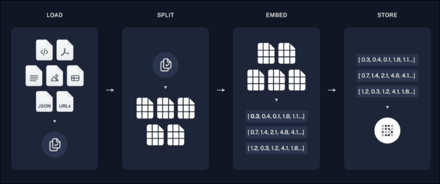
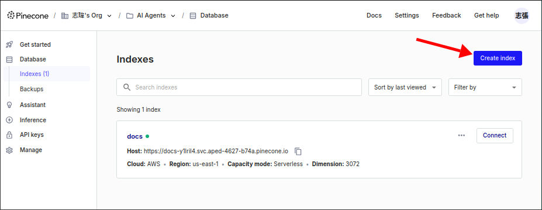
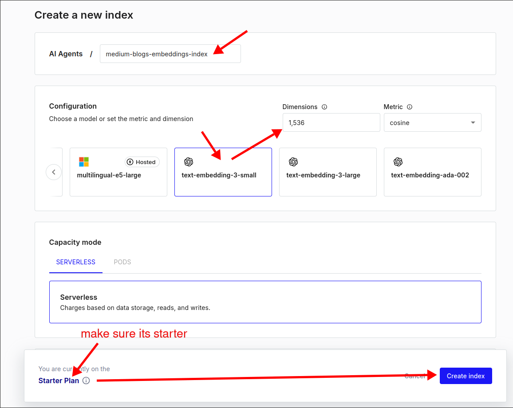
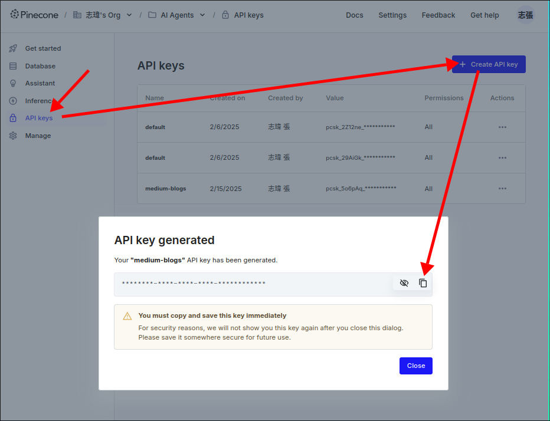

# Medium Analyzer: Boilerplate Project Setup

Create new project directory and install required packages with pipenv.

```sh
 mkdir intro-to-vector-dbs
 cd intro-to-vector-dbs/
 pipenv shell
 pipenv install langchain langchain-openai black python-dotenv langchain-pineco
```

Create a file called `ingestion.py` in the project directory.

File: /home/matt/Projects/intro-to-vector-dbs/ingestion.py
```python
if __name__ == "__main__":
    print("Ingesting...")
```

We'll use this file to do below tasks:



Create a file called `mediumblog1.txt` and copy a random blog post from Medium into it.


File: /home/matt/Projects/intro-to-vector-dbs/mediumblog1.txt
```text
Vector Database: What is it and why you should know it?
Ejiro Onose

Ejiro Onose
·

Follow
9 min read
·
Dec 22, 2023

    “If 2021 was the year of graph databases, 2023 is the year of vector databases” — Chip Huen.

Why? you ask...

...(ommitted for brevity)...

```

Now, we need to prepare an index of Pinecone to store the embeddings of the blog post. Pinecone is a most popular managed vector database. We don't need to care about the infrastructure, scaling, or maintenance of the vectore database with it.



Then, create new Pinecone API key and store it in a file called `.env` in the project directory.



File: /home/matt/Projects/intro-to-vector-dbs/.env
```sh
# for Langsmith (copy from other project)
LANGSMITH_TRACING=true
LANGSMITH_ENDPOINT="https://api.smith.langchain.com"
LANGSMITH_API_KEY="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"
LANGSMITH_PROJECT="Medium-Blogs" # modify this to other name

# copy the name of the index you created in Pinecone
INDEX_NAME="medium-blogs-embeddings-index"
# copy the Pinecone API key you created
PINECONE_API_KEY="pcsk_5o6pAq_J6Z3MRpXTNHBntKP9m73aAvkbWjKAkVxe36gjYDPKWKzsxMEVJdGXqT9dSMLucs"
```

And then, load above variables into environment with `python-dotenv` package.

```py
from dotenv import load_dotenv # import
load_dotenv() # load the variables from .env file to environment

if __name__ == "__main__":
    print("Ingesting...")
```

So far, we have prepared a medium blog, a vector database, and some environment variables. We will continue setting up this project in the next article.


