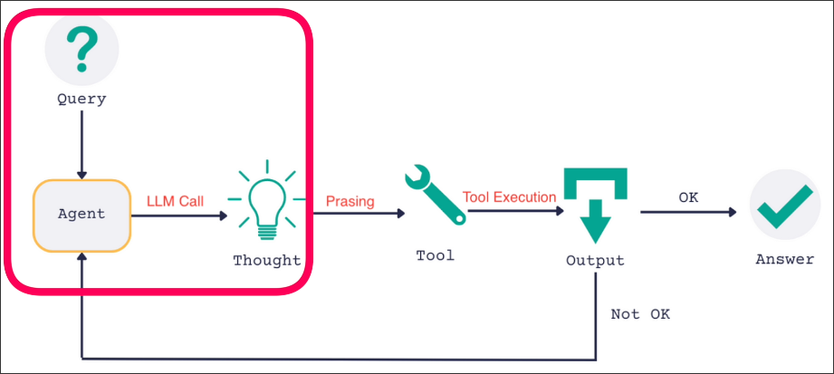
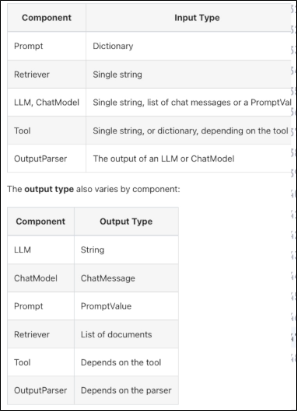
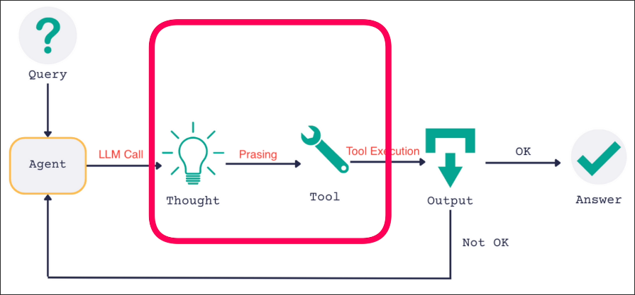
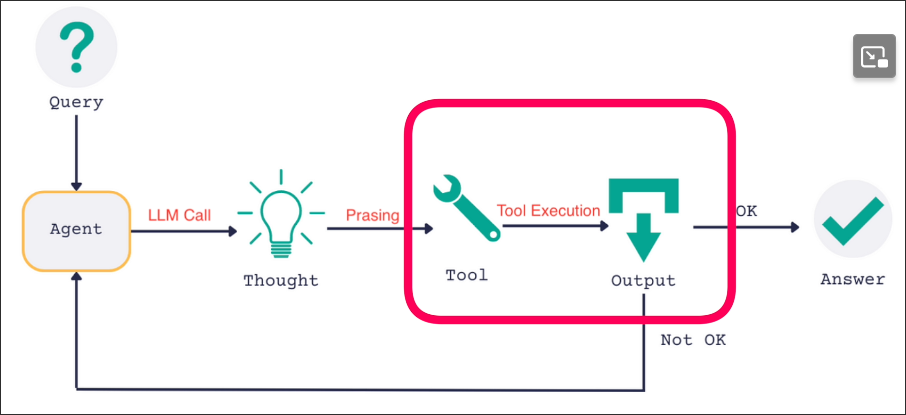

# ReAct prompt, LLM Reasoning Engine, Output Parsing and Tool Execution

Continuing from [[2025-02-14_Defining-Tools-for-our-ReAct-agent|the previous topic]], we need to build the entire process shown in the following image step by step.

## First Step: Query --> Prompt --> Thought!



Use LCEL to connect the prompt with LLM and add dict at the beginning to receive user input.

LCEL just likes shell pipe, it has lots of benefits, such as:
- parallel processing
- fallback
- streaming support
- reduce abstraction, more readable
- async, batch, and more...

Here is the link of official document: [link](https://python.langchain.com/v0.1/docs/expression_language/)


File: /home/matt/Projects/react-langchain/main.py
```python
from dotenv import load_dotenv
from langchain.agents import tool
from langchain.prompts import PromptTemplate
from langchain_core.tools import render_text_description
from langchain_openai import ChatOpenAI
load_dotenv()


@ tool
def get_text_length(text: str) -> int:
    """Returns the length of the text by characters"""
    return len(text.strip("'\n").strip('"'))


if __name__ == "__main__":
    print("Hello ReAct LangChain!")

    template = """
    Answer the following questions as best you can. You have access to the following tools:

    {tools}

    Use the following format:

    Question: the input question you must answer
    Thought: you should always think about what to do
    Action: the action to take, should be one of [{tool_names}]
    Action Input: the input to the action
    Observation: the result of the action
    ... (this Thought/Action/Action Input/Observation can repeat N times)
    Thought: I now know the final answer
    Final Answer: the final answer to the original input question

    Begin!

    Question: {input}
    """

    tools = [get_text_length]

    prompt = PromptTemplate.from_template(template=template).partial(
        tools=render_text_description(tools),
        tool_names=", ".join([t.name for t in tools]),
    )

    llm = ChatOpenAI(temperature=0, model="gpt-4o-mini")
    llm = llm.bind(stop=["\nObservation"])

    # Connect the prompt with the LLM
    agent = {"input": lambda x: x['input']} | prompt | llm
    #       ^^^^^^^^^^^^^^^^^^^^^^^^^^^^^^^
    #       prompt input access dict, and total agent input access dict also,
    #       so we need to use lambda to extract the input from the dict to group
    #       the input dict to prompt

    res = agent.invoke({"input": "What is the length of the text 'DOG'?"})
    #          ^^^^^^^^^^^^^^^^^^^^^^^^^^^^^^^^^^^^^^^^^^^^^^^^^^^^^^^^^^^
    #          as mention above, total agent input access dict, too

    print(res)
```

Above, we can see that LangChain attempts to unify the input of all components as dict input, but there are still some differences. For example, the input of llm is either a direct string or a list of messages. The input/output format of each component is listed below:




Let's run the code above and see the output (Thought!):
```sh
 python main.py

Hello ReAct LangChain!

content="Thought: I need to find the length of the text 'DOG' in characters. \nAction: get_text_length \nAction Input: 'DOG' "
additional_kwargs={'refusal': None}
response_metadata={ ... }
id='run-63bfccf7-28c8-4e3b-9744-df7f91e7f3fe-0'
usage_metadata={ ... }
```

In the output above, the key point is that we see it conforms to the format of the prompt, with three parts: *Thought*, *Action*, *Action Input*.

Action should be the tool name (function name), and Action Input should be the input of the tool(function). It seems that the output is correct.


## Second Step: Output Parsing

Next, we need to parse the output of the LLM and use the tool with the input to get *Observation*.



Although the LLM output already contains keywords *Action* and *Action Input*, it is actually just a string, so we need to use Regular Expression to parse this string. Fortunately, LangChain provides tools to help us parse this type of string.

```py
from dotenv import load_dotenv
from langchain.agents import tool
from langchain.prompts import PromptTemplate
from langchain_core.tools import render_text_description
from langchain_openai import ChatOpenAI
from langchain.agents.output_parsers import ReActSingleInputOutputParser # import the parser
load_dotenv()


@ tool
def get_text_length(text: str) -> int:
    """Returns the length of the text by characters"""
    return len(text.strip("'\n").strip('"'))


if __name__ == "__main__":
    print("Hello ReAct LangChain!")

    template = """..."""

    tools = [get_text_length]

    prompt = PromptTemplate.from_template(template=template).partial(
        tools=render_text_description(tools),
        tool_names=", ".join([t.name for t in tools]),
    )

    llm = ChatOpenAI(temperature=0, model="gpt-4o-mini")
    llm = llm.bind(stop=["\nObservation"])

    agent = {"input": lambda x: x['input']} | prompt | llm | ReActSingleInputOutputParser()
    #                                                      ^^^^^^^^^^^^^^^^^^^^^^^^^^^^^^^^
    #                                                      this parser help us to parse the output of ReAct agent
    #                                                      it'll use regular expression to extract the values of
    #                                                      \nAction and \nAction Input

    res = agent.invoke({"input": "What is the length of the text 'DOG'?"})

    print(res)
```

Let's run the code above and see the output:

```sh
 python main.py

Hello ReAct LangChain!

tool='get_text_length'
tool_input="'DOG'"
log="Thought: I need to find the length of the text 'DOG' in characters. \nAction: get_text_length \nAction Input: 'DOG' "
```

We can delve into the source code of ReActSingleInputOutputParser to see how it parses.

```py
class ReActSingleInputOutputParser(AgentOutputParser):
    """Parses ReAct-style LLM calls that have a single tool input.

    Expects output to be in one of two formats.

    If the output signals that an action should be taken,
    should be in the below format. This will result in an AgentAction
    being returned.

    Thought: agent thought here
    Action: search
    Action Input: what is the temperature in SF?

    If the output signals that a final answer should be given,
    should be in the below format. This will result in an AgentFinish
    being returned.

    Thought: agent thought here
    Final Answer: The temperature is 100 degrees
    """
    #The LLM output that can be parsed mentioned above has two formats, and our case is the first one. We don't need to pay attention to the second one for now.

    def get_format_instructions(self) -> str:
        return FORMAT_INSTRUCTIONS

    # It use this method to parse the output of LLM mainly
    def parse(self, text: str) -> Union[AgentAction, AgentFinish]:
        includes_answer = FINAL_ANSWER_ACTION in text
        regex = (
            r"Action\s*\d*\s*:[\s]*(.*?)[\s]*Action\s*\d*\s*Input\s*\d*\s*:[\s]*(.*)" # basically it just use regular expression to extract the values of \nAction and \nAction Input
        )
        action_match = re.search(regex, text, re.DOTALL)
        if action_match:
            if includes_answer:
                raise OutputParserException(
                    f"{FINAL_ANSWER_AND_PARSABLE_ACTION_ERROR_MESSAGE}: {text}"
                )
            action = action_match.group(1).strip()
            action_input = action_match.group(2)
            tool_input = action_input.strip(" ")
            tool_input = tool_input.strip('"')

            return AgentAction(action, tool_input, text)
            #      ^^^^^^^^^^^ so the return value is AgentAction

        elif includes_answer:
            return AgentFinish(
            #      ^^^^^^^^^^^ if LLM output is the second format, it'll return AgentFinish,
            #                  so the parser output type is Union[AgentAction, AgentFinish]
                {"output": text.split(FINAL_ANSWER_ACTION)[-1].strip()}, text
            )

        if not re.search(r"Action\s*\d*\s*:[\s]*(.*?)", text, re.DOTALL):
            raise OutputParserException(
                f"Could not parse LLM output: `{text}`",
                observation=MISSING_ACTION_AFTER_THOUGHT_ERROR_MESSAGE,
                llm_output=text,
                send_to_llm=True,
            )
        elif not re.search(
            r"[\s]*Action\s*\d*\s*Input\s*\d*\s*:[\s]*(.*)", text, re.DOTALL
        ):
            raise OutputParserException(
                f"Could not parse LLM output: `{text}`",
                observation=MISSING_ACTION_INPUT_AFTER_ACTION_ERROR_MESSAGE,
                llm_output=text,
                send_to_llm=True,
            )
        else:
            raise OutputParserException(f"Could not parse LLM output: `{text}`")

    @property
    def _type(self) -> str:
        return "react-single-input"
```

We can better refactor our codes by using the parser output type.

```py
from dotenv import load_dotenv
from langchain.agents import tool
from langchain.prompts import PromptTemplate
from langchain_core.tools import render_text_description
from langchain_openai import ChatOpenAI
from langchain.agents.output_parsers import ReActSingleInputOutputParser
from langchain.schema import AgentAction, AgentFinish
from typing import Union
load_dotenv()


@ tool
def get_text_length(text: str) -> int:
    """Returns the length of the text by characters"""
    return len(text.strip("'\n").strip('"'))


if __name__ == "__main__":
    print("Hello ReAct LangChain!")

    template = """..."""

    tools = [get_text_length]

    prompt = PromptTemplate.from_template(template=template).partial(
        tools=render_text_description(tools),
        tool_names=", ".join([t.name for t in tools]),
    )

    llm = ChatOpenAI(temperature=0, model="gpt-4o-mini")
    llm = llm.bind(stop=["\nObservation"])

    agent = {"input": lambda x: x['input']} | prompt | llm | ReActSingleInputOutputParser()

    res: Union[AgentAction, AgentFinish] = agent.invoke({"input": "What is the length of the text 'DOG'?"})
    #    ^^^^^^^^^^^^^^^^^^^^^^^^^^^^^^^

    print(res)
```


## Third Step: Tool Execution



```py
from dotenv import load_dotenv
from langchain.agents import tool
from langchain.prompts import PromptTemplate
from langchain_core.tools import render_text_description
from langchain_openai import ChatOpenAI
from langchain.agents.output_parsers import ReActSingleInputOutputParser
from langchain.schema import AgentAction, AgentFinish
from typing import List, Union # import 
from langchain.tools import BaseTool # import
load_dotenv()


@ tool
def get_text_length(text: str) -> int:
    """Returns the length of the text by characters"""
    return len(text.strip("'\n").strip('"'))

# define a function to find the tool by its name
def find_tool_by_name(tools: List[BaseTool], tool_name: str) -> BaseTool:
#                                                               ^^^^^^^^ in video, it's just Tool, but I check the return type of the tool, it's BaseTool
    for tool in tools:
        if tool.name == tool_name:
            return tool
    raise ValueError(f"Tool with name {tool_name} not found in tools list")


if __name__ == "__main__":
    print("Hello ReAct LangChain!")

    template = """..."""

    tools = [get_text_length]

    prompt = PromptTemplate.from_template(template=template).partial(
        tools=render_text_description(tools),
        tool_names=", ".join([t.name for t in tools]),
    )

    llm = ChatOpenAI(temperature=0, model="gpt-4o-mini")
    llm = llm.bind(stop=["\nObservation"])

    agent = {"input": lambda x: x['input']} | prompt | llm | ReActSingleInputOutputParser()

    agent_step: Union[AgentAction, AgentFinish] = agent.invoke({"input": "What is the length of the text 'DOG'?"})
#   ^^^^^^^^^^ replace 'res' with 'agent_step' for better understanding

    # if the output is AgentAction, we need to execute the tool
    if isinstance(agent_step, AgentAction):
    #                         ^^^^^^^^^^^ because we have defined the output type of the parser, so we can use it here to check the type
        tool_name = agent_step.tool
        tool_to_use = find_tool_by_name(tools, tool_name)
        #             ^^^^^^^^^^^^^^^^^ use the above defined function to find the tool by its name
        tool_input = agent_step.tool_input

        observation = tool_to_use.invoke({"text": tool_input})
        #                        ^^^^^^^ in video, it uses '.func', but It may be removed in newer version, so I use '.invoke' instead
        #                                '.invoke' need a dict input, so we need to group the input to a dict

        # print the use tool, input and observation(output) to exit this topic :D
        print(f"tool name: {tool_name}, tool input: {tool_input}, observation: {observation}")

```
Run the code above and see the output:

```sh
 python main.py

Hello ReAct LangChain!

tool name: get_text_length, tool input: 'DOG', observation: 3
```


