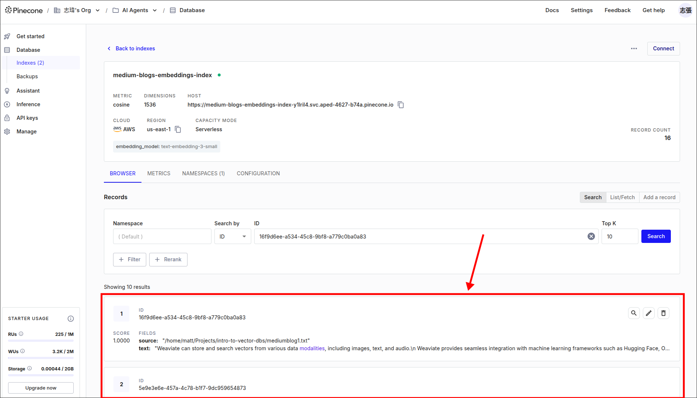

# Medium Analyzer: Ingestion Implementation

In this topic, we want to use various classes introduced in [[2025-02-15_The-GIST-of-RAG-Embeddings,-Vector-Databases-and-Retrieval|the previous topic]] to ingest data into vector storage.


File: /home/matt/Projects/intro-to-vector-dbs/ingestion.py
```python
import os
from dotenv import load_dotenv

from langchain_community.document_loaders import TextLoader
from langchain_text_splitters import CharacterTextSplitter
from langchain_openai import OpenAIEmbeddings
from langchain_pinecone import PineconeVectorStore

load_dotenv()

if __name__ == "__main__":
    print("Ingesting...")

    # load source data from a text file and convert it into a Document object
    loader = TextLoader("/home/matt/Projects/intro-to-vector-dbs/mediumblog1.txt")
    document = loader.load() # return list of ONE Document object, which has page_content and metadata fields

    # split the document into smaller chunks (list of Document objects)
    text_splitter = CharacterTextSplitter(chunk_size=1000, chunk_overlap=0)
    #                                                                    ^ for easy learning, we set this to 0
    documents = text_splitter.split_documents(document) # return list of multiple smaller Document objects

    # create embeddings object
    embeddings = OpenAIEmbeddings() # it'll use model `text-embedding-ada-002` by default (you can check source code)

    # iterate over the documents and generate embeddings for each, then store them in Pinecone index
    PineconeVectorStore.from_documents(
        documents,
        embeddings,
        index_name=os.environ["INDEX_NAME"]
    )
```

`page_content` is the text content of the document, and `metadata` is a dictionary containing lots of useful information about the document (in our case, only the `source` exists).

Let's run the script and see the results.

```bash
 python ingestion.py
Ingesting...
```

Check the Pinecone dashboard to see the ingested data.



We can see that the Pinecone already extracted the `source` from the Document `metadata` and `text` from the Document `page_content`.


