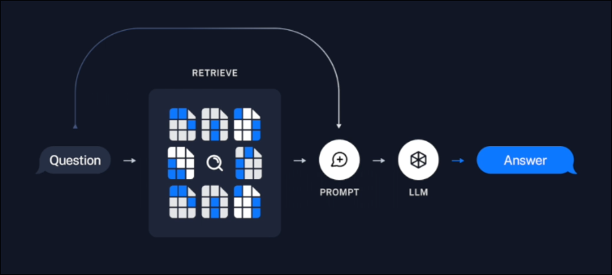
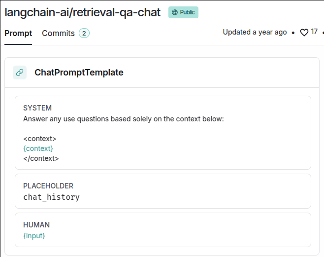

# Medium Analyzer: Retrieval Implementation with chains

This topic, we want to retrieve revalent documents about question from vector storage and augment them with original question to a prompt. Then send the prompt to a language model to generate the final answer.




## Create new file for retrieval and QA

File: /home/matt/Projects/intro-to-vector-dbs/main.py
```python
if __name__ == '__main__':
    print("Rretrieving...")

    query = "What is Pinecone in machine learning?" # this is the question
```


## Create a Retrieval Chain

```py
from dotenv import load_dotenv
from langchain.chains.retrieval import create_retrieval_chain # import

load_dotenv()


if __name__ == '__main__':
    print("Rretrieving...")

    query = "What is Pinecone in machine learning?"

    # create a retrieval chain
    retrival_chain = create_retrieval_chain(
        retriever=, # we'll fill this in later
        combine_docs_chain= # we'll fill this in later
    )

    # we can invoke it, and it'll go through all the steps to get the final result
    result = retrival_chain.invoke(input={"input": query})
```

## Fill in the retriever

```py
import os # import
from dotenv import load_dotenv
from langchain_openai import OpenAIEmbeddings # import
from langchain_pinecone import PineconeVectorStore # import
from langchain.chains.retrieval import create_retrieval_chain

load_dotenv()


if __name__ == '__main__':
    print("Rretrieving...")

    query = "What is Pinecone in machine learning?"

    # create vector store obejct
    vectorstore = PineconeVectorStore(
        index_name=os.environ["INDEX_NAME"],
        embedding=OpenAIEmbeddings()
    )

    retrival_chain = create_retrieval_chain(
        retriever=vectorstore.as_retriever(),
        #         ^^^^^^^^^^^^^^^^^^^^^^^^^^ turn the vector store into a retriever and pass it here
        combine_docs_chain=
    )

    result = retrival_chain.invoke(input={"input": query})

```

## Fill in the combine_docs_chain

We want to pass a chain to combine_docs_chain, this chain will merge the original question and the retrieved documents into a single prompt, and then pass it to the language model to generate an answer. Langchain provides a function create_stuff_documents_chain that can easily generate this chain.

```py
import os
from dotenv import load_dotenv
from langchain_openai import OpenAIEmbeddings, ChatOpenAI
from langchain_pinecone import PineconeVectorStore
from langchain import hub
from langchain.chains.combine_documents import create_stuff_documents_chain
from langchain.chains.retrieval import create_retrieval_chain

load_dotenv()


if __name__ == '__main__':
    print("Rretrieving...")

    query = "What is Pinecone in machine learning?"

    vectorstore = PineconeVectorStore(
        index_name=os.environ["INDEX_NAME"],
        embedding=OpenAIEmbeddings()
    )

    retrival_chain = create_retrieval_chain(
        retriever=vectorstore.as_retriever(),
        combine_docs_chain=create_stuff_documents_chain(
        #                  ^^^^^^^^^^^^^^^^^^^^^^^^^^^^ this function creates a chain that combines the original question and the retrieved documents
        #                                               into a single prompt and passes it to the language model to generate an answer
            llm=ChatOpenAI(), # so it needs a language model to generate the answer
            prompt=hub.pull("langchain-ai/retrieval-qa-chat") # and it needs a template to combine the documents and the question to a single prompt
        )
    )

    result = retrival_chain.invoke(input={"input": query})

    print(result)

```

Now, we can run the script and see the result.

```bash
 python main.py

Rretrieving...

{
  'input': 'What is Pinecone in machine learning?',
  'context': [Document(...), Document(...), Document(...), Document(...)],
  'answer': 'In machine learning, Pinecone is a fully managed cloud-based vector database designed to help businesses and organizations build and deploy large-scale ML applications efficiently. Pinecone can h andle large-scale ML applications with millions or billions of data points, providing infrastructure management, high query throughput, low latency search, and security features. It is user-friendly and accessible via a simple API for storing and retrieving vector data, supporting real-time updates for efficient database maintenance. Pinecone can also be synced with data from various sources using tools like Airbyte and monitored using Datadog.'
}
```

## Dive into the stuff template



You can see that this template is actually a list of messages, the {context} part will automatically insert the retrieved documents into the combine_docs_chain, {input} is the original query, so it passed when invoking the retrieval_chain by passing in `input={"input": query}`.


