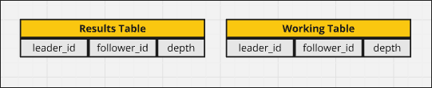
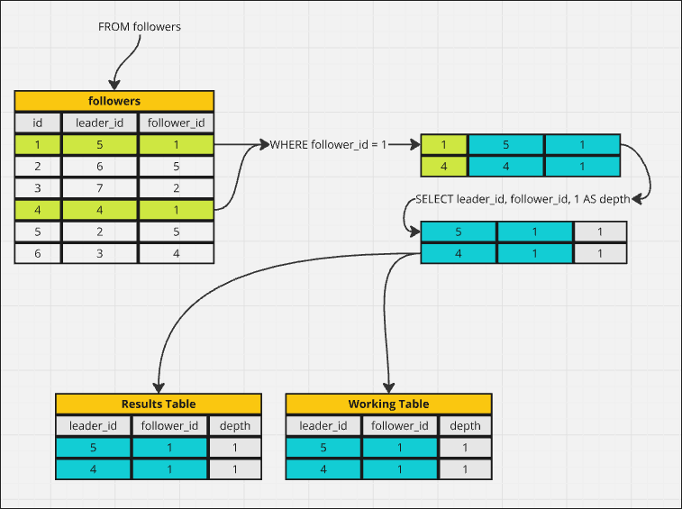
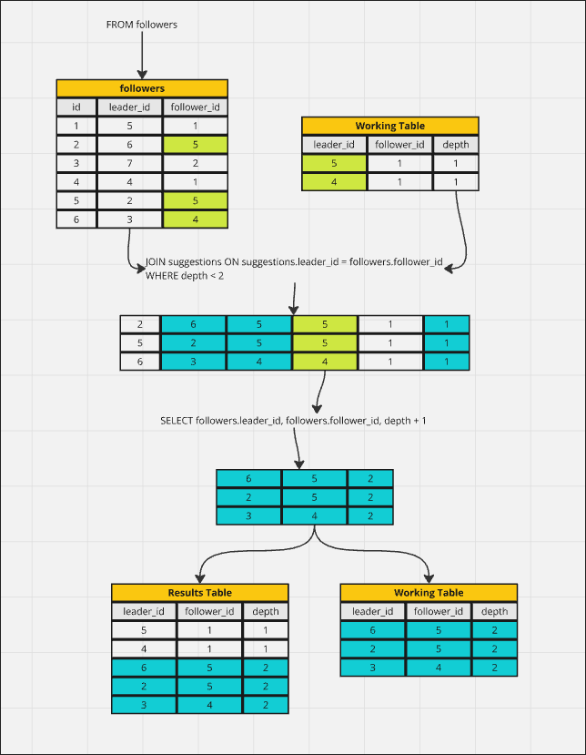
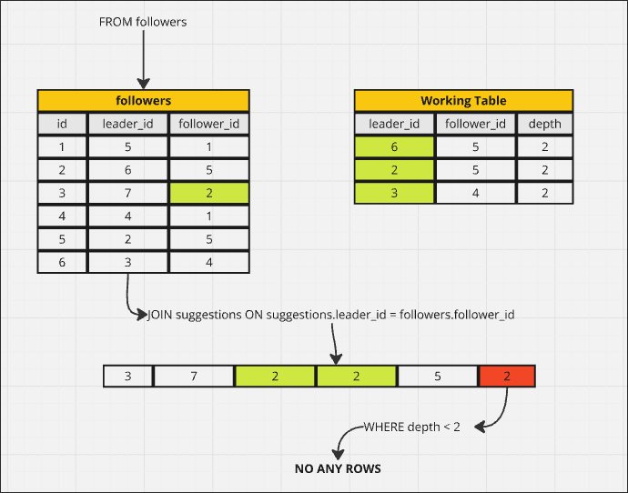
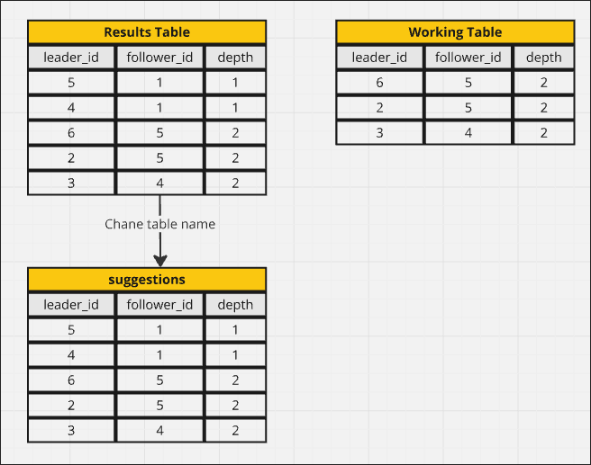
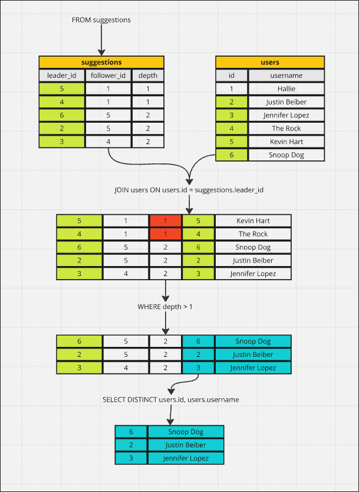

# Walking Through Recursion

```sql
WITH RECURSIVE suggestions(leader_id, follower_id, depth) AS (
      SELECT leader_id, follower_id, 1 AS depth
      FROM followers
      WHERE follower_id = 1
    UNION
      SELECT followers.leader_id, followers.follower_id, depth + 1
      FROM followers
      JOIN suggestions ON suggestions.leader_id = followers.follower_id
      WHERE depth < 2 
)

SELECT DISTINCT users.id, users.username
FROM suggestions
JOIN users ON users.id = suggestions.leader_id
WHERE depth > 1
LIMIT 30;
```

In this topic, we want to explain above query step by step.

1. define two tables with columns from parameters



2. Initial query

```sql
      SELECT leader_id, follower_id, 1 AS depth
      FROM followers
      WHERE follower_id = 1
```



3. Recursive query

```sql
      SELECT followers.leader_id, followers.follower_id, depth + 1
      FROM followers
      JOIN suggestions ON suggestions.leader_id = followers.follower_id
      WHERE depth < 2 
```




Becuase this query has output rows, so we need to run this query again.

4. Recursive query again

```sql
      SELECT followers.leader_id, followers.follower_id, depth + 1
      FROM followers
      JOIN suggestions ON suggestions.leader_id = followers.follower_id
      WHERE depth < 2 
```



Because this query has no output rows, so we stop the recursion. And change thename of the results table to `suggestions`.



5. Query out of CTE syntax

```sql
SELECT DISTINCT users.id, users.username
FROM suggestions
JOIN users ON users.id = suggestions.leader_id
WHERE depth > 1
```




As shown above, recursive CTE is not something easy to imagine, but you need to be able to think of using it to solve problems in some scenarios. Typically, any hierarchical structure can be solved using recursive CTE.


