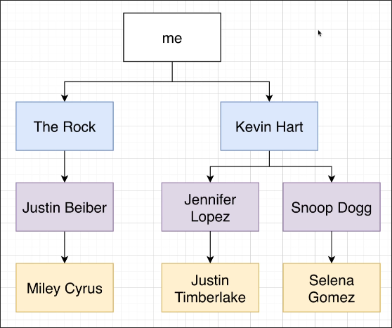
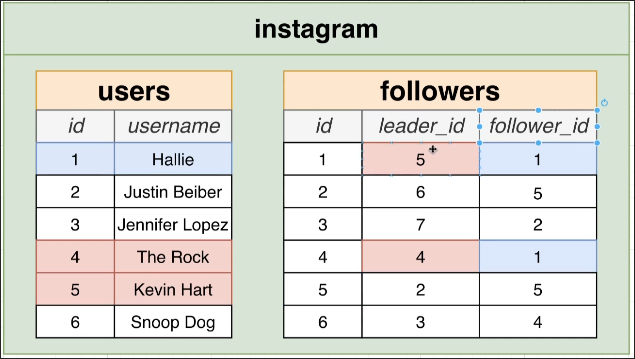
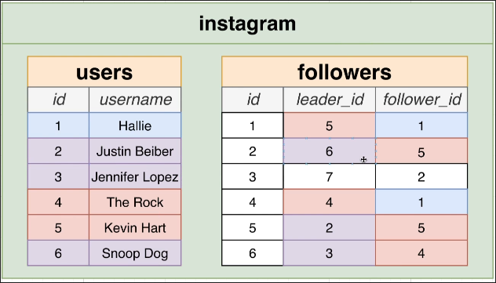
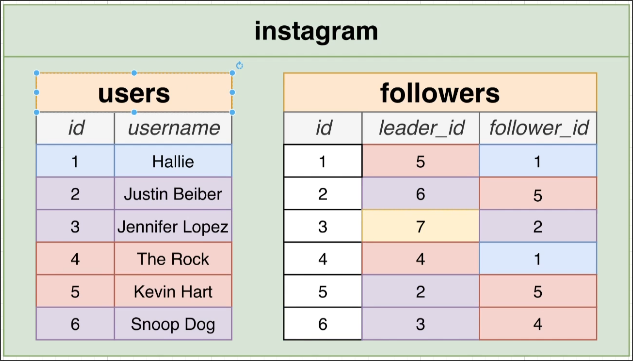

# Writing the Query

Using [[2025-02-17_Why-Use-Recursive-CTEs?|the previous topic]] as an example, we will try to write a query using recursive CTE to solve the problem.










```sql
WITH RECURSIVE suggestions(leader_id, follower_id, depth) AS (
--                                                 ^^^^^ this is not from any tables but just for record the depth of the tree
--                                                       so we can limit the depth of the tree or filter out the very first node
      SELECT leader_id, follower_id, 1 AS depth
      --                               ^^^^^^^^ remember to set 1 as the `depth`
      FROM followers
      WHERE follower_id = 1000
      --                  ^^^^ here we assume the top of the tree is the user with id 1000
    UNION
      -- we'll explain the recursive progress details in the next topic
      SELECT followers.leader_id, followers.follower_id, depth + 1
      FROM followers
      JOIN suggestions ON suggestions.leader_id = followers.follower_id
      WHERE depth < 3
)

SELECT DISTINCT users.id, users.username
FROM suggestions
JOIN users ON users.id = suggestions.leader_id
WHERE depth > 1
LIMIT 30;


-- OUTPUT --
  id  |      username      
------+--------------------
 1897 | Wilhelm_Bergnaum
 2413 | Herminia23
 3846 | Zachery.Botsford36
  318 | Mozelle.Franecki
 1397 | Vanessa.Wehner
 2027 | Percival82
  958 | Ambrose80
 2311 | Brayan.Beatty
 1635 | Reva.Witting
 1916 | Mafalda97
 4921 | Jazmyne79
 1929 | Aubrey.Harris63
 4941 | Mona66
  921 | Fae_Abernathy
 1535 | Margarita_Mohr8
 1281 | Kolby39
 2285 | Laurence_Moen
 3332 | Wilson.Bailey
 1363 | Michale65
 1121 | Beatrice_Spencer
 3430 | Meaghan70
 4343 | Ebony.Rath14
  387 | Breanne90
 1917 | Cleveland.Corwin85
 2298 | Piper.Monahan62
 4205 | Berry35
 3011 | Lempi_Powlowski
 1072 | Lexie20
 2637 | Dorthy43
 4545 | Gerard.Hyatt8
(30 rows)

```

Recursive CTEs take some time to query. You can limit the depth to speed up the query, or simply use LIMIT to limit the number of results.


