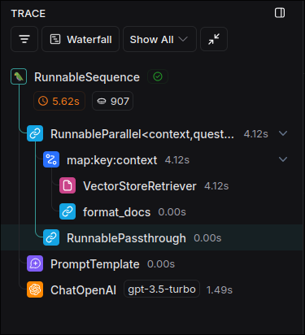

# Medium Analyzer: Retrieval Implementation with LCEL

In [[2025-02-17_Medium-Analyzer:-Retrieval-Implementation-with-chains|the previuos topic]], we created a retrieval chains with `create_retrieval_chain` and `create_stuff_documents_chain` functions which are hard to understand.

So, in this topic, we will create a new retrieval chain with LCEL (Language Chain Embedding Layer) which is easier to understand and use.

And we'll use custom prompt for our rag architecture, btw.

```py
import os
from dotenv import load_dotenv
from langchain_core.prompts import PromptTemplate
from langchain_core.runnables import RunnablePassthrough
from langchain_openai import OpenAIEmbeddings, ChatOpenAI
from langchain_pinecone import PineconeVectorStore

load_dotenv()


# a very simple function to take a list of documents and format them into a single string
def format_docs(docs):
    return "\n\n".join(doc.page_content for doc in docs)

if __name__ == '__main__':
    print("Rretrieving...")

    query = "What is Pinecone in machine learning?"

    llm = ChatOpenAI()

    vectorstore = PineconeVectorStore(
        index_name=os.environ["INDEX_NAME"],
        embedding=OpenAIEmbeddings()
    )

    # instead of pulling template from hub, we can create our own template
    template = """Use the following pieces of context to answer the question at the end.
    If you don't know the answer, just say that you don't know, don't try to make up an answer.
    Use three sentences maximum and keep the answer as concise as possible.
    Always say "thanks for asking!" at the end of the answer.


    {context}


    Question: {question}


    Helpful Answer:"""
    # This template basically has the same content as the template we previously pulled, but we specifically mentioned using 'thanks for asking!' as the closing phrase for the response.

    # turn the template into a prompt, so we can use it in our chain
    custom_rag_prompt = PromptTemplate.from_template(template)

    # Then, we compose the chain with LCEL
    rag_chain = (
        {
            "context": vectorstore.as_retriever() | format_docs,
            #          ^^^^^^^^^^^^^^^^^^^^^^^^^^^^^^^^^^^^^^^^
            #          query string -> vector store -> format docs
            "question": RunnablePassthrough()
            #          ^^^^^^^^^^^^^^^^^^^^^^ it'll just pass the query string as is
        }
        | custom_rag_prompt # then dict from above {"context": ..., "question": ...} will be passed to the prompt
        | llm # prompt'll fill up the placeholders and pass the complete prompt to the llm
    )

    res = rag_chain.invoke(query) # we can invoke it, note the `query` here is just a string

    print(res)

```

Let's run the code and see the output.

```sh
 python main.py

Rretrieving...

content='Pinecone is a fully managed cloud-based vector database designed for scala nd low-latency search capabilities. Pinecone provides a secure and user-friendly pl g!' additional_kwargs={'refusal': None} response_metadata={'token_usage': {'complet _tokens': 0, 'audio_tokens': 0, 'reasoning_tokens': 0, 'rejected_prediction_tokens' system_fingerprint': None, 'finish_reason': 'stop', 'logprobs': None} id='run-2086f 07, 'input_token_details': {'audio': 0, 'cache_read': 0}, 'output_token_details': {
```

We can check LangSmith to get more information about the progress of the chain.


