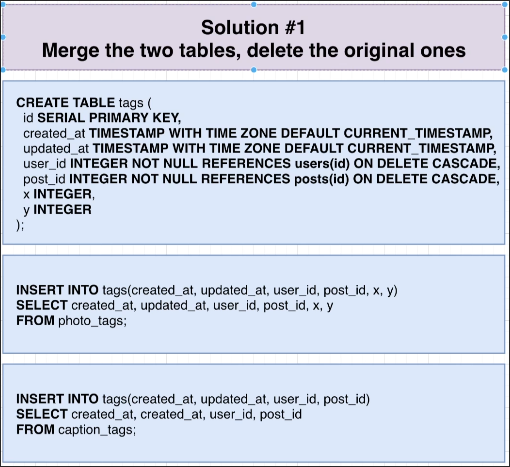

# A Possible Solution for Merging Tables

To solve the issue of [[2025-02-19_Most-Popular-Users|the previous topic]], we can use these two tables to create a new table and delete the original tables.

Then, delete the original tables.

## Tremendous Downsides of above Solution

The above solution, although the simplest and most intuitive, has two big drawbacks:

1. **Can't copy over the `id` values**

Because the IDs of the two tables may overlap, they cannot be directly copied to a new table. If any other table uses this ID for reference, it will break.

2. **Break any existing queries that refer to original tables**

Because the original table has been deleted, all queries that used the original table will be invalid. We need to rewrite all of these parts.

## Conclusion

Therefore, we do not recommend doing this, in the next topic we will provide a better solution.

