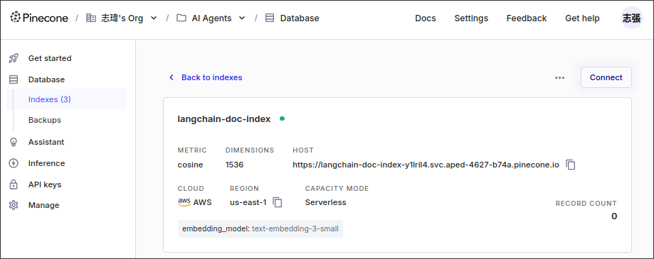

# Environment Setup


## Create a new project, install dependencies

```sh
$ git clone git@github.com:emarco177/documentation-helper.git
$ cd documentation-helper/
# switch to the branch 1-starter-here
$ pipenv shell
$ pipenv install
```


## Create a new index of Pinecone



Copy the index name and the API key to the `.env` file.

File: /home/matt/Github/documentation-helper/.env
```sh
LANGSMITH_TRACING=true
LANGSMITH_ENDPOINT="https://api.smith.langchain.com"
LANGSMITH_API_KEY="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"
LANGSMITH_PROJECT="langchain-doc-index"
INDEX_NAME="langchain-doc-index" # <--- Copy the index name here
PINECONE_API_KEY="pcsk_5o6pAq_J6Z3MRpXTNHBntKP9m73aAvkbWjKAkVxe36gjYDPKWKzsxMEVJdGXqT9dSMLucs" # <--- Copy the API key here
```

## Download the Langchain documentation zip file

```sh
 tree
.
├── langchain-docs  # unzip the file here
│   └── api.python.langchain.com
│       └── en
│           └── latest
│               ├── agents
│               │   ├── langchain.agents.agent.AgentExecutor.html # each doc is a html file
│               │   ├── langchain.agents.agent.Agent.html
│               ├── ai21_api_reference.html
│               ├── airbyte_api_reference.html
│               ├── anthropic_api_reference.html
│               ├── astradb_api_reference.html
│               ├── aws_api_reference.html
│               ├── azure_dynamic_sessions_api_reference.html
│               ├── callbacks
│               │   ├── langchain.callbacks.streaming_aiter.AsyncIteratorCallbackHandler.html
│               │   ├── langchain.callbacks.streaming_aiter_final_only.AsyncFinalIteratorCallbackHandler.html
│               ├── chains
│               │   ├── langchain.chains.api.base.APIChain.html
│               │   ├── langchain.chains.base.Chain.html
│               ├── chat_models
│               │   └── langchain.chat_models.base.init_chat_model.html
│               ├── chroma_api_reference.html
│               ├── cohere_api_reference.html
│               ├── community_api_reference.html
│               ├── core_api_reference.html
│               ├── couchbase_api_reference.html
│               ├── elasticsearch_api_reference.html
│               ├── embeddings
│               │   └── langchain.embeddings.cache.CacheBackedEmbeddings.html
│               ├── evaluation
│               │   ├── langchain.evaluation.agents.trajectory_eval_chain.TrajectoryEvalChain.html
│               │   ├── langchain.evaluation.agents.trajectory_eval_chain.TrajectoryEval.html
│               ├── exa_api_reference.html
│               ├── experimental_api_reference.html
│               ├── fireworks_api_reference.html
│               ├── google_genai_api_reference.html
│               ├── google_vertexai_api_reference.html
│               ├── groq_api_reference.html
│               ├── hub
│               │   ├── langchain.hub.pull.html
│               │   └── langchain.hub.push.html
│               ├── huggingface_api_reference.html
│               ├── ibm_api_reference.html
│               ├── indexes
│               │   ├── langchain.indexes.vectorstore.VectorstoreIndexCreator.html
│               │   └── langchain.indexes.vectorstore.VectorStoreIndexWrapper.html
│               ├── langchain_api_reference.html
│               ├── memory
│               │   ├── langchain.memory.buffer.ConversationBufferMemory.html
│               │   ├── langchain.memory.buffer.ConversationStringBufferMemory.html
│               ├── milvus_api_reference.html
│               ├── mistralai_api_reference.html
│               ├── model_laboratory
│               │   └── langchain.model_laboratory.ModelLaboratory.html
│               ├── mongodb_api_reference.html
│               ├── nomic_api_reference.html
│               ├── nvidia_ai_endpoints_api_reference.html
│               ├── openai_api_reference.html
│               ├── output_parsers
│               │   ├── langchain.output_parsers.boolean.BooleanOutputParser.html
│               ├── pinecone_api_reference.html
│               ├── postgres_api_reference.html
│               ├── prompty_api_reference.html
│               ├── qdrant_api_reference.html
│               ├── retrievers
│               │   ├── langchain.retrievers.contextual_compression.ContextualCompressionRetriever.html
│               ├── robocorp_api_reference.html
│               ├── runnables
│               │   ├── langchain.runnables.hub.HubRunnable.html
│               ├── smith
│               │   ├── langchain.smith.evaluation.config.EvalConfig.html
│               ├── storage
│               │   ├── langchain.storage.encoder_backed.EncoderBackedStore.html
│               ├── text_splitters_api_reference.html
│               ├── together_api_reference.html
│               ├── voyageai_api_reference.html
│               └── weaviate_api_reference.html
├── LICENSE
├── Pipfile
├── Pipfile.lock
└── README.md
```

You can see that each doc is a html file as shown above. And the file structure is like this:

File: /home/matt/Github/documentation-helper/langchain-docs/api.python.langchain.com/en/latest/airbyte_api_reference.html
```html
<!DOCTYPE html>
<!--[if IE 8]><html class="no-js lt-ie9" lang="en" > <![endif]-->
<!--[if gt IE 8]><!-->
<html class="no-js" lang="en"> <!--<![endif]-->
<head>
    <meta charset="utf-8">
    <meta name="generator" content="Docutils 0.17.1: http://docutils.sourceforge.net/" />

    <meta name="viewport" content="width=device-width, initial-scale=1.0">

    
        <title>langchain_airbyte 0.1.1 &mdash; 🦜🔗 LangChain 0.2.6</title>
    
    <link rel="canonical"
          href="https://api.python.langchain.com/en/latest/airbyte_api_reference.html"/>

    

    <link rel="stylesheet"
          href="_static/css/vendor/bootstrap.min.css"
          type="text/css"/>
            <link rel="stylesheet" href="_static/pygments.css" type="text/css"/>
            <link rel="stylesheet" href="_static/css/theme.css" type="text/css"/>
            <link rel="stylesheet" href="_static/autodoc_pydantic.css" type="text/css"/>
            <link rel="stylesheet" href="_static/copybutton.css" type="text/css"/>

```

But now LLMs are very advanced, they can directly understand these html documents, so we actually don't need to convert them into plain text files to embed them into Pinecone.


## Create a new file for ingestion

```sh
$ touch ingestion.py
```

We will start writing the code for ingestion.py in the next topic to embed the Langchain documentation into Pinecone.


