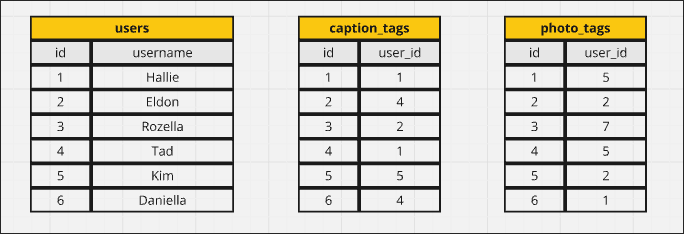
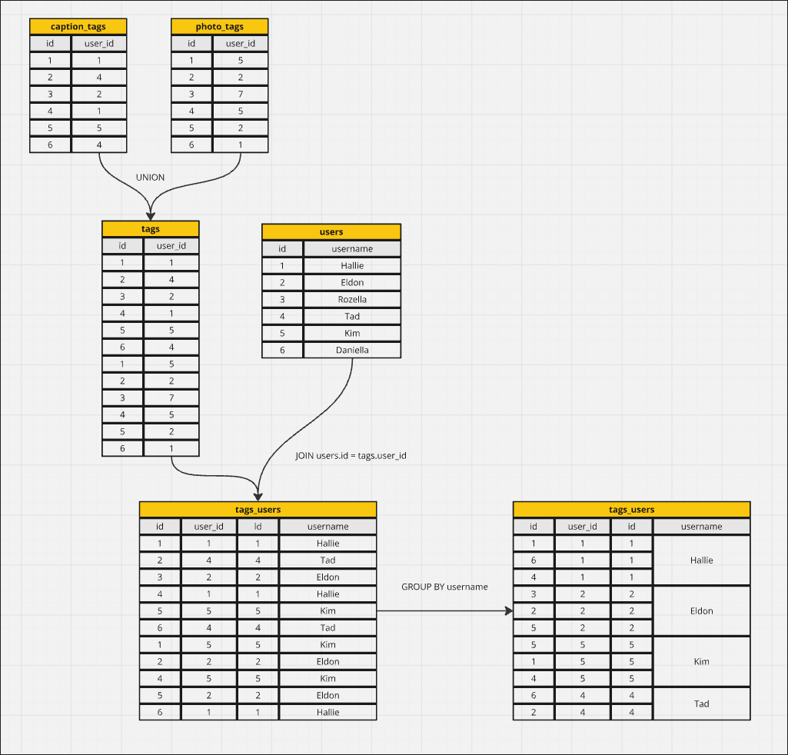

# Most Popular Users

## Question



Given the tables above, write a SQL query to find the most popular user, which means the user who has been tagged the most.


## Solution

We can use the following diagram to solve this problem:



Let's write the SQL query:

```sql
WITH tags AS (
  SELECT user_id FROM photo_tags
  UNION ALL
  SELECT user_id FROM caption_tags
)

SELECT username, COUNT(*)
FROM users
JOIN tags ON tags.user_id = users.id
GROUP BY username
ORDER BY COUNT(*) DESC;


--- OUTPUT ---
         username         | count 
--------------------------+-------
 Kristofer.Torphy         |    19
 Ramiro.Bartoletti92      |    18
 Noble21                  |    17
 Marco.Pfannerstill       |    16
 Brooke_Donnelly89        |    16
 Webster_Franecki96       |    16
 Cole_Sporer              |    16
 Brandy_Bins25            |    16
 Malika59                 |    15
 -- ...
 -- ...
 Tressa.Carroll38         |     1
 Elinor.Powlowski         |     1
 Bryon_Robel67            |     1
 Berta.Lang               |     1
(5341 rows)

```

The awkward point is that we often UNION `caption_tags` and `photo_tags` tables, perhaps it was a design mistake from the beginning? Our next topic will discuss how to fix this issue in the future.


