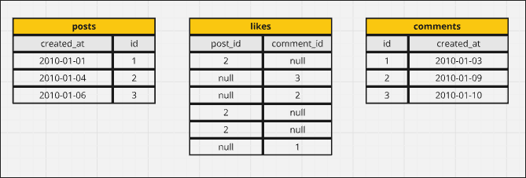
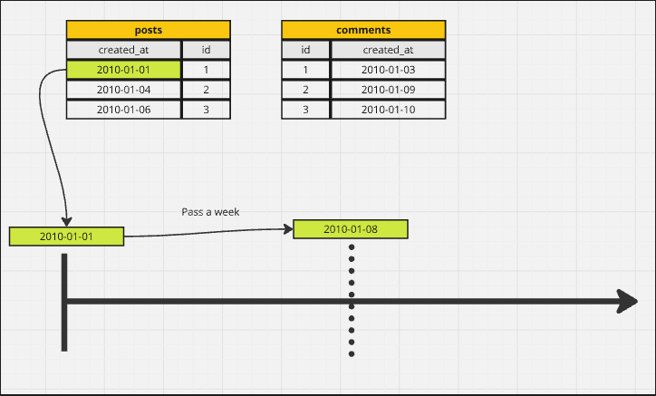
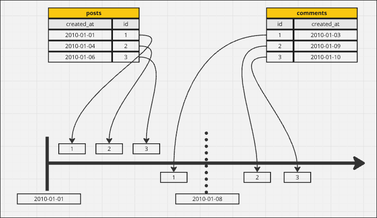
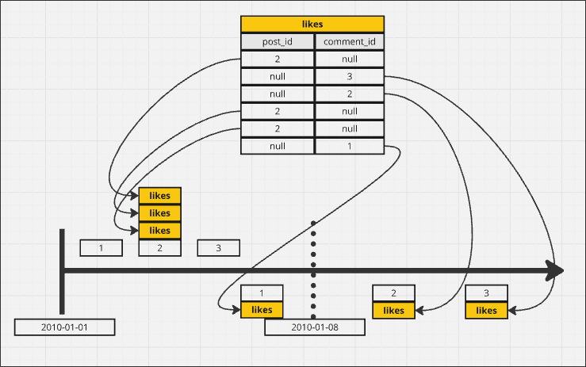
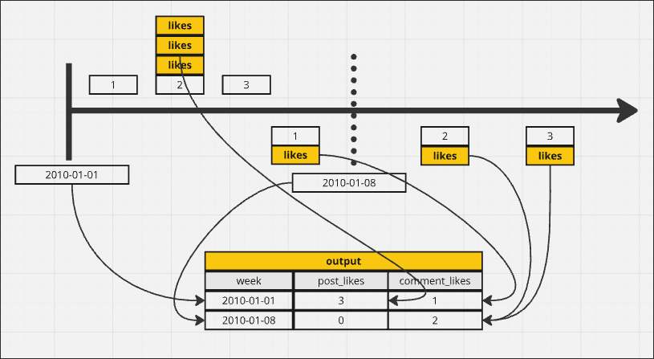

# Grouping by Week

Below are three related tables, where `likes` can like both `posts` and `comments`.

We need to query the above three tables above to answer the following questions:

> For each week, show the number of likes that posts an comments recieved. Use the posts and comment create_at date, not when the like was recieved.

1. We group with week from the very first post and comment.

2. split ids to different groups by their create_at date.

3. Add the like to ids according to table `likes`.

4. convert diagram result to table.

